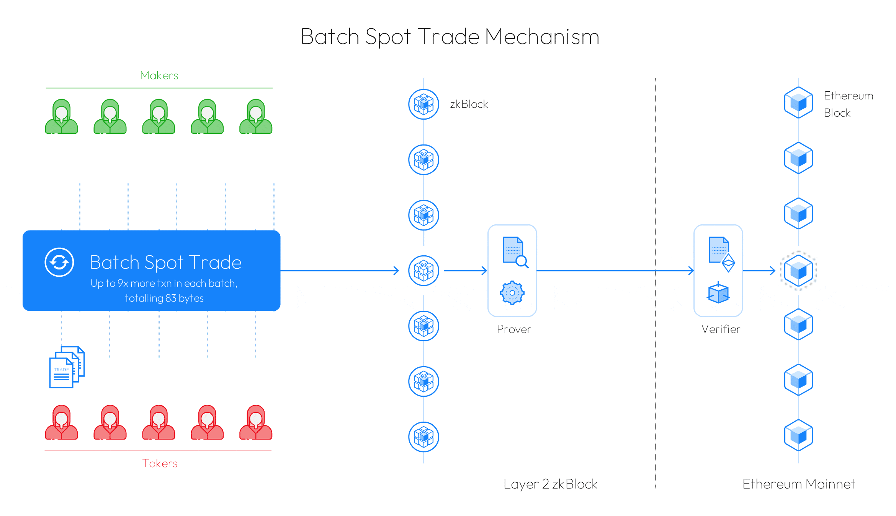

# Batch Spot Trade

What is an Orderbook?

Think of an order book as a marketplace where buyers and sellers come together to make trades.  Essentially, an order book is a list of all open trades that are available on an exchange for any particular trading pair. When a buy order (bid) is matched with a sell order (ask), a successful trade is thus made. \
\
The order book also helps traders become more informed about the trades they intend to make by allowing them to analyze buy and sell activity. Using an order book to make informed decisions about trades enables traders to increase their likelihood of making a profitable trade.

<figure><figcaption>
Simple outline of an orderbook 
</figcaption></figure>

A matching system is needed to match buy and sell orders. Matching of orders usually occurs when compatible buy orders and sell orders are placed in close proximity in terms of price and time.

Generally, orders are considered compatible if the maximum price of the buy order matches or exceeds the minimum price of the sell order. On a deeper level, different exchanges employ a variety of methods to prioritize orders for matching.

### Challenges of Centralized Orderbook Exchange

**Custody risk**\
As the popular saying goes "Not your keys, not your coins". Centralized order book exchanges maintain custody over users' private keys. They are a prime target for hackers and millions of users' funds have been lost over the years.&#x20;

**Lack of transparency** \
Centralized order books are opaque, which can give rise to fake volumes, insider trading, wash trading, and price manipulation. Such instances put retail traders in an unfavorable position, providing a false view of the order book which could potentially lead to financial losses. &#x20;

### Challenges of On-chain Limit Orders

**High cost**\
Every action and order has transaction costs in the form of gas fees. For example, a taker will need to consider gas fees for token approval, transaction signature, and order cancellation even. In the end, the resulting limit order might end up as an unprofitable trade for the taker, which makes on-chain limit orders unsuitable for high-frequency trading and/or smaller-size trades too.&#x20;

**Increased likelihood of failed transactions**\
On-chain limit orders will only be successfully transacted if there is a matching taker. There are numerous instances that can result in failed transactions such as possible front-running, insufficient funds in the maker's wallet as funds are moved, price discrepancy between chart price and on-chain execution price, etc. Ultimately, this can be rather costly and inefficient from a taker's perspective.

### Challenges of Traditional ZK-rollup Orderbook

**Data storage on-chain**\
Every action requires a blockchain transaction which consumes data storage. The size of the state needed to represent outstanding orders in an order book will also consume much data storage. ZK-rollups are able to bring about significant data size reduction but are still considered relatively inefficient to handle a large, high-frequency order book.&#x20;

In the previous design version, a one-to-one transaction matching done on a traditional zk-rollup order book cost \~72 bytes; parameters include Token A/B, Fill Amt A/B, FeeBips, Gas Amt A/B, totaling up to \~72 bytes before submitting on-chain (As shown in the diagram below).&#x20;

### Introduction to Batch Spot Trade  &#x20;

As explained above, an order book exchange in its traditional setup comes with many technical challenges in order for it to be suitable in the blockchain industry. The Batch Spot Trade was thus designed to overcome these technical hurdles, to further improve the efficiency of the traditional matching model by orders of magnitudes, while adapting to the technical characteristics and cost model of zk-rollups.&#x20;

#### Data compression and optimization &#x20;

The holy grail is always to find a cost-efficient way of bundling transactions before submitting them on-chain. This is finally possible with Zero-Knowledge Proof (ZKP) on Zero-Knowledge rollups (L2).&#x20;

However, that is still inefficient to handle the demands of a large, high-frequency order book. A solution was needed to bundle up even more transactions in order to maximize the merits of ZK technology. Batch Spot Trade was thus designed, providing an elegant solution to bundle up to 9x more transactions, consuming only 83 bytes before being recorded on-chain.&#x20;

### An in-depth look: Batch Spot Trade

Based on research into traditional order book exchanges, it was found that an efficient order book exchange often consists of a very large "Maker" who transacts with many other "Takers". Essentially, "Makers" play an important role in an efficient order book exchange. These behaviour characteristics of "Makers" and "Takers" often observed in traditional order book exchanges were considered in the design of Batch Spot Trade.&#x20;

#### Validation check for matched transactions  &#x20;

In Batch Spot Trade, one of the most critical parameters is the token balances of users. It is vital to ensure the accuracy of matched transactions and token balances amongst the transacted users. To further ensure system accuracy, a token balance counter is added. This is elaborated in the diagram below; whereby the total sum of the 3 tokens (namely ETH, USDC, USDT) is calculated to ensure the token balance always = 0 between the total no. of users in each data bundle.

#### Optimization of Batch Spot Trade

The next step was to figure how exactly how many users and aggregated orders can be bundled into each Batch Spot Trade whilst keeping it to 83 bytes. After months of research and countless simulations, an innovative combination design was created to optimize for Batch Spot Trade.&#x20;

No. of users - Number of users making transactions

No. of users' aggregated orders - Total sum of orders by each user

In order to achieve max optimization of bundling 9X more transactions, there will be a total of 6 users in each Batch Spot Trade, with the user's aggregated orders in the following combination of 4,2,1,1,1,1. User A - 6 orders, User B - 2 orders, User C - 1 order, and so on.  With this design combination, the data can thus be compressed and represented using only 83 bytes, potentially bundling up to 9x more transactions.&#x20;

#### Overall review of Batch Spot Trade

Essentially, the Batch Spot Trade mechanism is able to intelligently bundle up and compress many transactions before adding into DeGate Layer 2 block. After which, a validity proof is generated through cryptographic means which is then submitted to Ethereum Mainnet. The animation gif details the mechanism from start to end state.&#x20;

<figure><figcaption>
Inner workings of Batch Spot Trade mechanism
</figcaption></figure>

## Conclusion

Layer 2, in particular, ZK-rollups will play an important part in making Ethereum more scalable compared to the current Layer 1 level. Powered with an innovative solution such as Batch Spot Trade built on top of ZK technology, DeGate is now able to achieve a high TPS, low gas cost, and efficient decentralized order-book exchange that is highly sought after by the community.&#x20;

