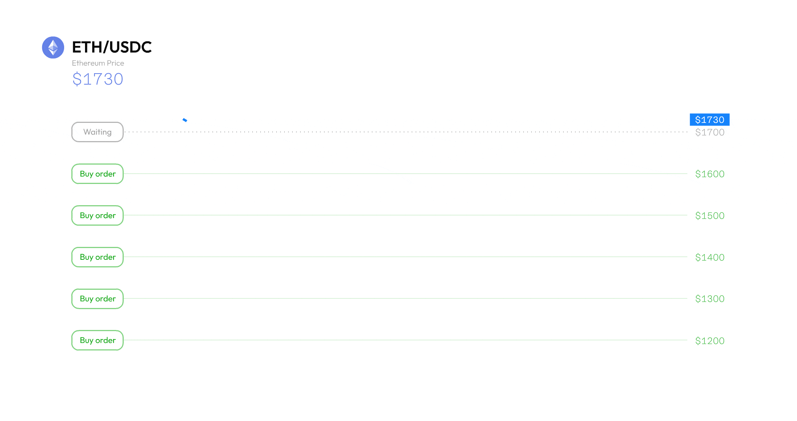

# Decentralized Grid Strategy

### What is Grid Strategy?

Grid Strategy or grid trading is a trading mechanism that automates buying and selling within a defined range. It enables you to place a series of buy and sell orders within a designated price range; when a buy order is executed, it instantly places another sell order at a higher grid level, and vice versa. Grid strategy performs best in sideways markets when prices fluctuate regularly within a defined range, enabling you to make profits on small price changes.


Grid Strategy in action, buying low and selling high


#### Benefits of Grid Strategy

Grid Strategy is popular among traders who do not have the luxury of time or energy to screen watch constantly. Some of the notable advantages of Grid Strategy include:

Automation - The upper and lower price limits are first defined, after which the grid buy/sell orders are placed and executed automatically according to the price movement of the underlying asset. The grid strategy runs 24/7 (essentially buying low, selling high), generating passive profit for traders.

Adaptability - Grid density can be optimized for various circumstances. In the short term, hundreds of grids can be set up to capture micro profit from the day's price changes; in the long term, selecting a larger range can enable the trader to profit gain from the overall sideways trend.&#x20;

Profitability - Grid trading performs best in sideways markets when the market is not showing any clear trend. A trader does not necessarily need to predict whether the asset in question’s price is going to trend up or down, and there is no input necessary once a grid strategy has been initiated, outside of monitoring the results.

### Design challenges of Grid Strategy (Decentralized)

Grid Strategy feature is commonly found on centralized exchanges (CEX). Trade execution is made easier on CEX as users do not have custody over their funds. In the current market, there are no decentralized grid trading protocols due to a couple of challenges;&#x20;

#### Wallet Signature

A typical grid trading setup may consist of 2 - 200 grid levels, depending on the user's input. Every single grid level represents either a buy or sell limit order which requires the user's wallet signature. On top of that, signature authorization usually takes a couple of seconds which may affect the grid order execution where markets move in microseconds.&#x20;

#### Live on-demand signature

In a live market scenario, prices may wick up or down within a short span of time. This will affect the grid orders which may be flipped from a buy order -> sell order OR sell order -> buy order. These reverse orders would require live signature authorization from the user which can be difficult to obtain if the user is away from their computers.&#x20;

### Introduction to Grid Strategy, Decentralized

In order to achieve the goal of building a decentralized grid strategy feature, we first identify and define the constants in a standard grid strategy set-up.

#### Constants

Level Amount - Allocated assets for each grid level, as determined from the user's input.&#x20;

Grid Offset - Difference between each grid level, determined by price range and number of grid levels.&#x20;

Order Offset - The difference between each order, was created for the calculation of reverse orders. Equivalent to grid offset.&#x20;

#### Buy/Sell Grids

Essentially, the standard grid strategy set-up is a bi-directional trading bot. To simplify the complications with regard to user signature, the grid strategy setup is broken down into 2 grid categories namely,

Buy Grid - setting up buy grid orders

Sell Grid - setting up sell grid orders&#x20;

#### Grid Signatures

The next step is to set up the transaction signatures for each Buy/Sell grid. The constants as previously defined are bundled into each grid transaction signature. Critically, the transaction signature will be tied to the first grid order which is defined as the grid closest to the current market price, and subsequent grid orders will be set up accordingly with the signature authorization from the first grid order.&#x20;


For example, the current market price of ETH is at $2000,\
For Buy Grid - the first grid order ("Buy 1") is defined at the closest grid level <$2000,

For Sell Grid - the first grid order ("Sell 1") is defined at the closest grid level >$2000,


Basically, this solves the need for the user to sign multiple transactions while the grid strategy is live in action.&#x20;

#### Example: ETH/USDC

1. User A sets up a manual grid strategy for ETH/USDC in the range of $1800 - $2300, while the current price of ETH stands at $2050. 10 grid lines are added with allocated assets of 0.5 ETH and 950 USDC.
2. As a result, 5 Sell Grids and 5 Buy Grids are set up accordingly to the input parameters.
3. For the Sell Grid, the user will need to approve and sign the "Sell Grid Txn Signature" on the first sell grid level (aka "Sell 1"), enabling the grid strategy mechanism to set up subsequent sell grid orders.
4. For the Buy Grid, the user will need to approve and sign the "Buy Grid Txn Signature" on the first buy grid level (aka "Buy 1"), enabling the grid strategy mechanism to set up subsequent buy grid orders.
5. The user simply sit back, relax and watch the grid strategy executes the various grid orders (essentially buying low and selling high), generating passive profits for the user!


Via this innovative technical design, users are now able to enjoy the benefits of grid trading AND having full custody of their own assets at the same time.&#x20;


.gif?alt=media\&token=7e95ad5b-fd9f-4b7f-8080-15c3762cd6fc)

### Strategies for Grid Trading&#x20;

There are 3 common strategies used in Grid Trading which largely depend on the market trends and the underlying asset performance.&#x20;

#### Normal Grid Strategy

This is best deployed in a turbulent market in which the underlying asset is consolidating or ranging.  Via a Normal Grid Strategy, the trader is able to set both buy and sell orders within the pre-defined price range, effectively making passive profits from the price action of the asset.&#x20;

<figure><figcaption>
 Normal Grid Strategy in action
</figcaption></figure>

#### Buy Grid Strategy

This strategy is best deployed in a downtrend market in which the underlying token price might fall further. Via a Buy Grid Strategy, the trader is able to set a series of buy orders **below** the market price, enabling him to buy the asset on the low. Additionally, the grid orders will be flipped to sell orders if the price bounces, profiting the trader within the grid range.&#x20;

The main premise of the Buy Grid Strategy is this - the underlying token has good potential which is suitable for a long-term hold, thus benefiting the trader in dollar averaging into the token even if its price falls outside of the grid range.&#x20;

<figure><figcaption></figcaption></figure>

#### Sell Grid Strategy

This is similar to the Buy Grid Strategy but in a different direction. The Sell Grid Strategy is best deployed in an uptrend market in which the underlying token will appreciate further. Via a Sell Grid Strategy, the trader is able to set a series of sell orders **above** the market price, enabling him to sell the asset on the high. Additionally, the grid orders will be flip to buy orders if the price break downwards, profiting the trader within the grid range.&#x20;

The main benefit of the Sell Grid Strategy is this - the trader will get to take profit incrementally as the underlying token price break upwards, maximizing profits along the way up and buying back as the token price retrace downwards.&#x20;

### Conclusion

Grid trading is an automated trading strategy unaffected by human emotions and is entirely determined by code. This strategy is best executed in a sideways market, generating passive income for users without having to constantly screen-watch.&#x20;

On top of that, by leveraging on DeGate's decentralized design to its grid strategy feature, users will now have full custody over their funds while enjoying the benefits of automated trading. With DeGate range of features such as limit orders and decentralized grid trading, users can finally sleep well no matter the market conditions.&#x20;
