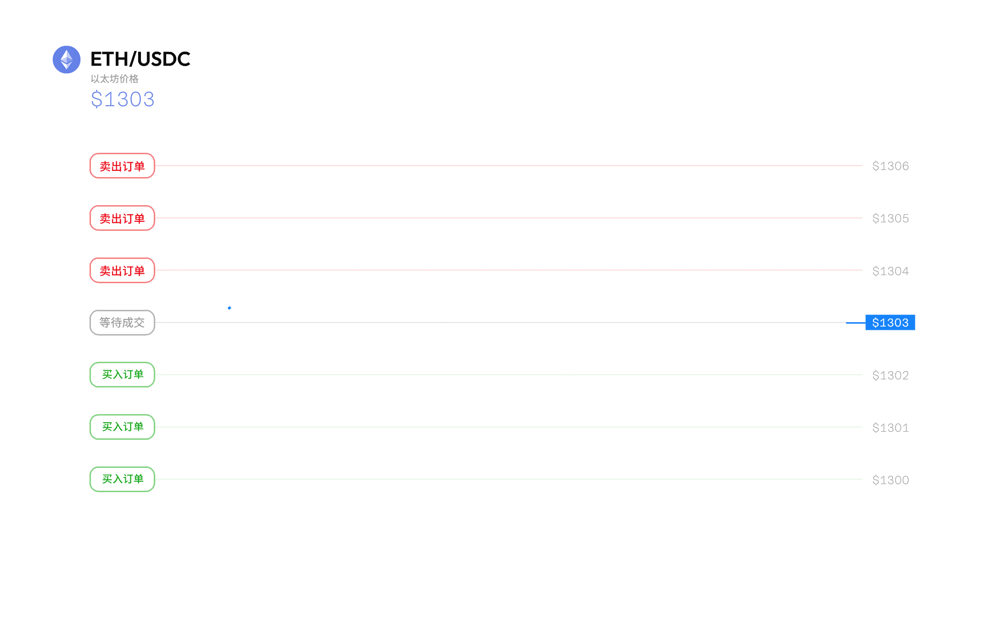

# 去中心化网格策略

什么是网格策略？

网格策略或网格交易是一种在一定范围内自动买入和卖出的交易机制。它允许你在指定的价格范围内放置一系列的买入和卖出订单；当买入订单执行时，它立即在更高的网格数量上放置另一个卖出订单，反之亦然。网格策略在价格在一定范围内波动且没有明显趋势的市场中表现最佳，让你能够通过小幅价格变动获取收益。

<figure><figcaption>
网格的本质是低买高卖
</figcaption></figure>

### 网格策略的优势&#x20;

网格策略受到那些没有足够时间或精力不断盯盘的交易者的青睐。网格策略具有以下一些显著优势：

**自动化** - 首先确定上下限价格，然后根据设置的价格变动自动放置和执行网格中买入/卖出订单。网格策略可以全天候运行（本质上是低买高卖），为交易者产生被动收益。

**可调整性** - 网格密度可以根据不同情况进行优化。短期内，可以设置数百个网格，以捕捉当天价格变动的微小利润；长期而言，选择较大的价格范围可以使交易者从整体横向趋势中获利。

**收益率** - 网格交易在市场没有明显趋势时表现最佳。交易者不需要预测所涉资产的价格是上涨还是下跌，一旦启动了网格策略，除了查看收益之外，不需要进行任何额外的输入。

### 设计去中心化网格策略所面临的挑战

网格策略功能通常可以在中心化交易所（CEX）上找到。在CEX上，由于用户不具备资金的监管权，交易执行变得更加容易。而，在当前市场中由于存在一些挑战，目前还没有项目方推出去中心化的网格交易协议。这些挑战包括：

#### 钱包签名

典型的网格交易，取决于用户的输入，可能包含2到200个网格数量。每个网格代表着一个买入或卖出的限价订单，都需要用户的钱包签名。除此之外，签名授权通常需要几秒钟的时间，这可能会影响到网格订单的执行，尤其是在市场以微秒级别的速度变动时。

#### 实时签名需求

在实时市场情景中，价格可能会在短时间内上涨或下跌。这将影响到网格订单，可能导致买单变成卖单，或卖单变成买单。这些相反的订单都需要用户进行实时签名授权，如果用户此时无法操作钱包，就很难获得签名授权。

### 去中心化网格策略简介

为了实现构建一个去中心化网格策略功能的目标，我们首先需要识别和定义标准网格策略设置中的常量。

网格单位 - 每个网格所要分配的资产量，由用户的输入确定。&#x20;

网格间隔 - 每个网格级别之间的差异，由价格范围和网格单位确定。&#x20;

正反向单数量差 - 每个订单之间的差异，用于计算反向订单。等同于网格间隔。

#### 买/卖单网格

基本上，标准的网格交易设置是一个双向交易机器人。为了简化与用户签名相关的复杂性，网格策略设置被分解为两个网格类别，即：

买单网格 - 设置买入网格订单&#x20;

卖单网格 - 设置卖出网格订单

#### 网格签名

下一步是为每个买入/卖出网格设置交易签名。之前设定的常量将被打包进每个网格交易签名中。关键的是，交易签名将与第一个网格订单绑定，该订单被定义为最接近当前市场价格的网格，随后的网格订单将根据第一个网格订单的签名授权进行设置。&#x20;


例如，以太坊的当前市场价格为2000美元，&#x20;

对于买入网格 - 第一个网格订单（"买入 1"）被定义在最接近2000美元以下的网格级别上

对于卖出网格 - 第一个网格订单（"卖出 1"）被定义在最接近2000美元以上的网格级别上


&#x20;基本上，这解决了用户在设置网格策略过程中需要多个交易签名的问题。

#### 示例：ETH/USDC

1. 用户A在以太坊/USDC交易对的价格范围为1800美元至2300美元之间设置了手动网格策略，而以太坊的当前价格为2050美元。添加了10个网格线，每个网格线分配了0.5个以太坊和950个USDC。
2. 根据输入参数设置了5个卖出网格和5个买入网格。
3. 对于卖单网格，用户需要批准并签署第一个卖单网格数量（即"卖出 1"）上的"卖单网格交易签名"，以使网格策略机制能够设置后续的卖出网格订单。
4. 对于买单网格，用户需要批准并签署第一个买单网格数量（即"买入 1"）上的"买单网格交易签名"，以使网格策略机制能够设置后续的买入网格订单。
5. 用户只需坐下来，放松身心，观察网格策略执行各种网格订单（基本上是低买高卖），为用户创造被动收益！


通过这种创新的技术设计，用户现在能在享受网格交易好处的同时完全掌控自己的资产。


<figure><figcaption>
使用创新技术设计的去中心化的网格策略
</figcaption></figure>

### 网格交易策略&#x20;

网格交易通常有三种常见的策略，主要取决于市场趋势和基础资产的表现。&#x20;

#### 普通网格策略&#x20;

这种策略最适用于市场动荡的情况，即基础资产处于震荡或区间的状态。通过普通网格策略，交易者可以在预定的价格范围内设置买入和卖出订单，有效地从资产的价格波动中获得被动收益。

<figure><figcaption>
网格策略
</figcaption></figure>

#### 买单网格策略&#x20;

这种策略最适用于下跌行情的市场，其中基础代币的价格可能进一步下跌。通过买入网格策略，交易者可以在市场价格下方设置一系列买入订单，使其能够以较低的价格买入资产。此外，如果价格反弹，网格订单将被翻转为卖出订单，从而使交易者在网格范围内获利。&#x20;

买入网格策略的主要前提是：基础代币具有良好的潜力，适合长期持有，即使其价格超出网格范围下跌，也能使交易者以分批买入的方式获利。

<figure><figcaption>
买单网格策略
</figcaption></figure>

#### 卖单网格策略&#x20;

这种策略与买入网格策略相似，但方向相反。卖出网格策略最适用于上涨行情的市场，其中基础代币将进一步升值。通过卖出网格策略，交易者可以在市场价格上方设置一系列卖出订单，使其能够以较高的价格卖出资产。此外，如果价格下跌，网格订单将被翻转为买入订单，从而使交易者在网格范围内获利。&#x20;

卖出网格策略的主要好处是：交易者将在基础代币价格上升时逐步获利，利润最大化，并在代币价格回调时进行回购。

<figure><figcaption>
卖单网格策略
</figcaption></figure>

### 结论&#x20;

网格交易是一种不受人类情绪影响，完全由代码决定的自动化交易策略。这种策略最适用于横盘市场，在不需要持续监视行情的情况下为用户生成 被动收入。&#x20;

此外，通过利用 DeGate 的去中心化设计实现网格交易功能，用户现在可以完全掌握自己的资金，同时享受自动化交易的好处。凭借 DeGate 的各种功能，如限价单和去中心化网格交易，用户终于可以在无论市场条件如何的情况下都能够安心入眠。
