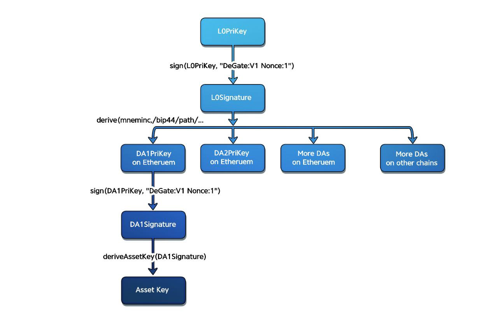

# Wallet Addresses & Networks

One DeGate wallet gives you an address on each supported chain. All of these addresses are derived from a single key that you control, using open standards (BIP39 and BIP44), and each address belongs exclusively to you. This page explains where your addresses come from and how to use them across networks.

## Your addresses across chains

When you receive assets, use your DeGate address for the network the sender is on: tap **Receive** in the app, pick the chain, and copy the address or share the QR code. Your DeGate address is the same across all EVM chains (Ethereum, Base, Arbitrum, Optimism, Polygon, BNB and so on); Solana, Aptos, and Bitcoin use their own address formats. Incoming deposits are detected automatically, and everything you receive shows up in your unified balance.

Since only your private key can authorize transactions from these addresses, DeGate or any other external party cannot unilaterally move your funds.

## How addresses are derived

<figure><figcaption></figcaption></figure>

### 1. Your wallet key (L0PriKey)

Each user starts with an ECDSA private key. DeGate is not able to access the raw L0PriKey.

### 2. You sign deterministic content (L0Signature)

DeGate requests a signature on a fixed message, such as "DeGate: V1 Nonce:1", using the L0PriKey. This ensures uniqueness per user and per key reset. The wallet responds with an ECDSA signature, labeled L0Signature.

### 3. A mnemonic is generated from the hashed signature (BIP39)

DeGate's front end hashes the L0Signature to create a seed, which is converted into a mnemonic phrase according to BIP39, the widely used standard behind 12 to 24 word recovery phrases.

### 4. Per-chain private keys are derived (BIP44)

BIP44 is a framework for hierarchical deterministic wallets, allowing different derivation paths for different blockchains. Using the mnemonic, your browser or app derives a private key for each supported chain (for example Solana or Base), each cryptographically tied back to your original wallet. DeGate provides the UI so you never manage multiple mnemonics or do derivations manually.

The whole derivation runs on your device. What makes this self-custody is step 1 and step 4 together: DeGate neither sees the root key nor the derived per-chain keys.

## Supported networks

The current list of supported networks appears in [What is DeGate](../README.md#supported-networks), with per-network fee tiers on the [Fees](../fees.md) page.

## FAQ

**Can I send any token to my DeGate address?**
Send tokens on their matching network to your address for that network. Everything on supported networks lands in your unified balance.

**If DeGate disappeared, would I lose access to these addresses?**
The addresses are derived from your key via open standards (BIP39/BIP44), not from anything only DeGate holds. See the [Self-Custody FAQ](../security/self-custody-faq.md) for the recovery discussion.
