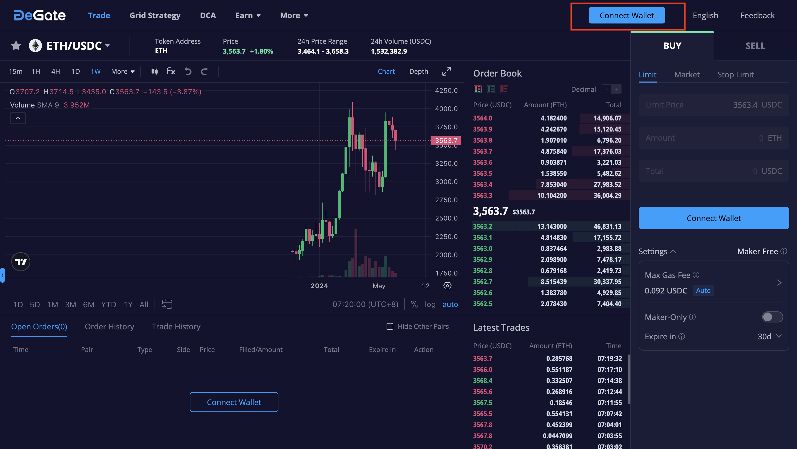
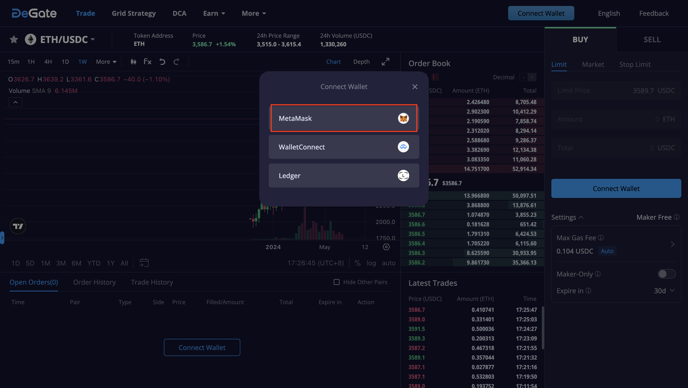
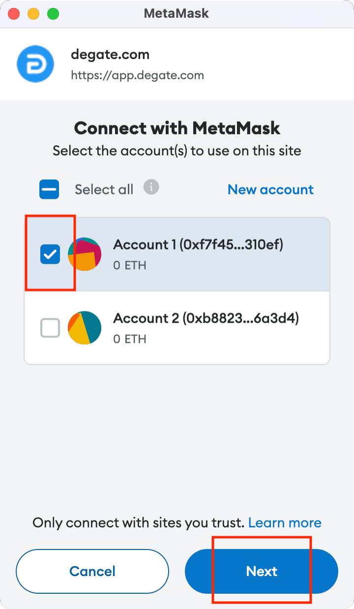
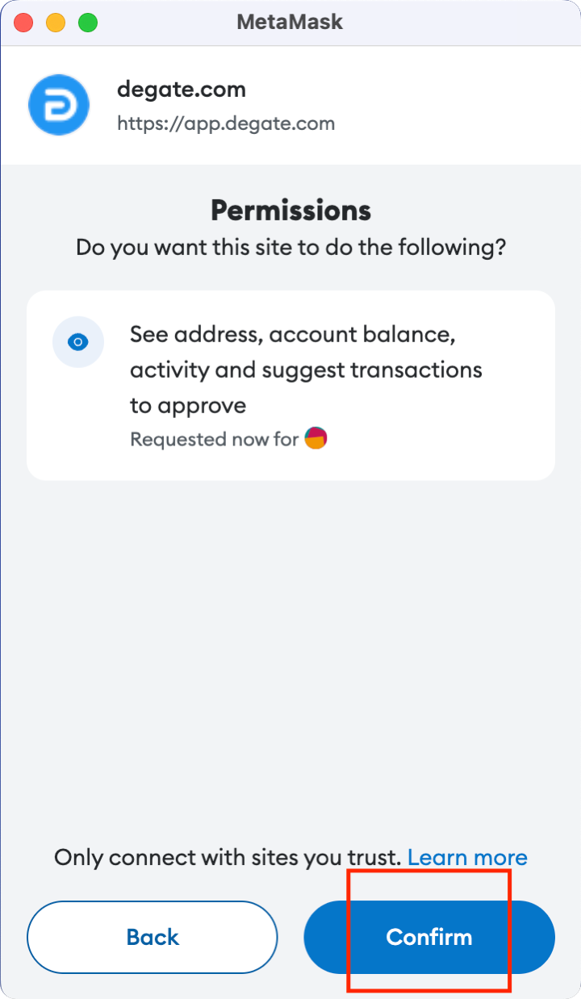
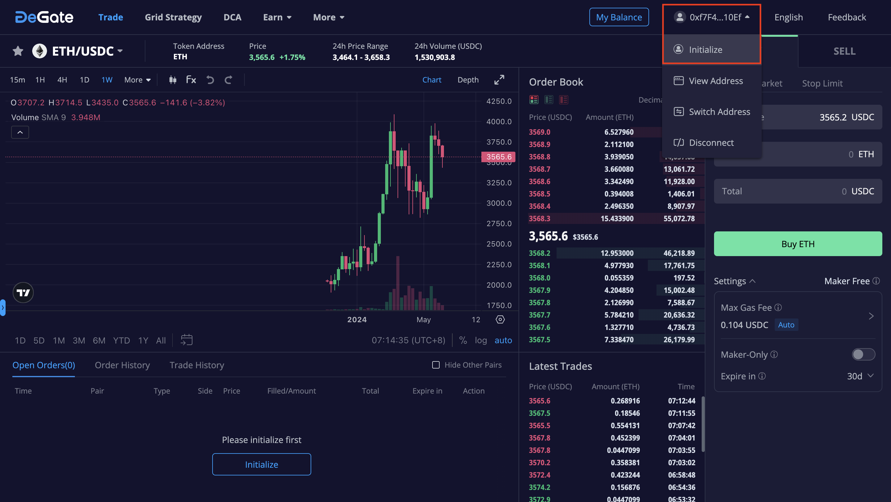
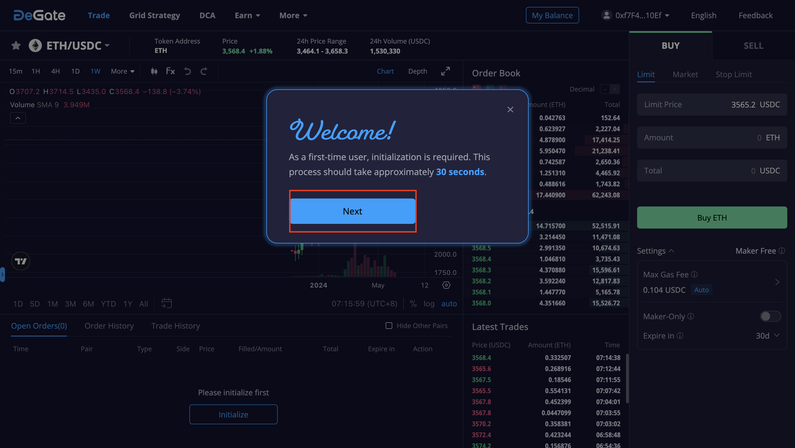
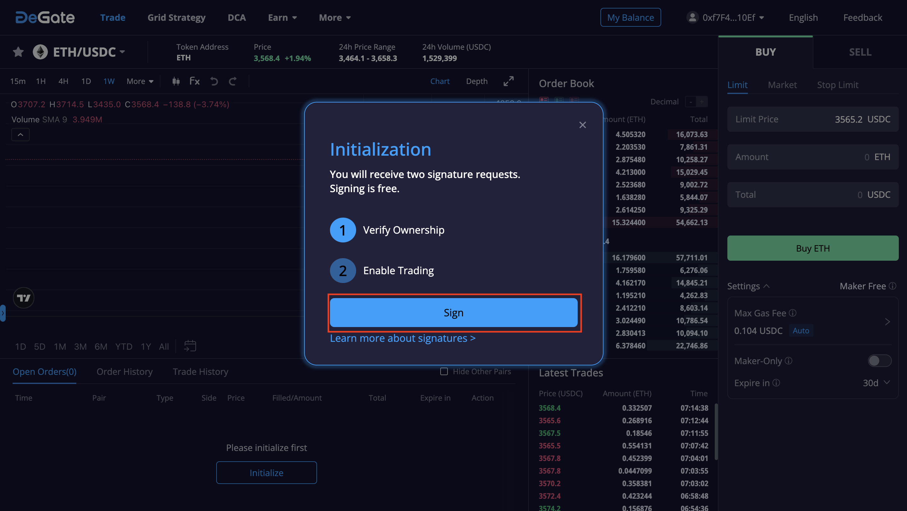
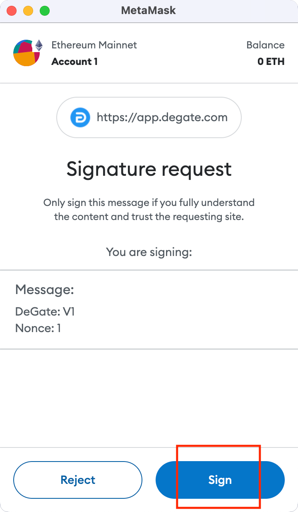
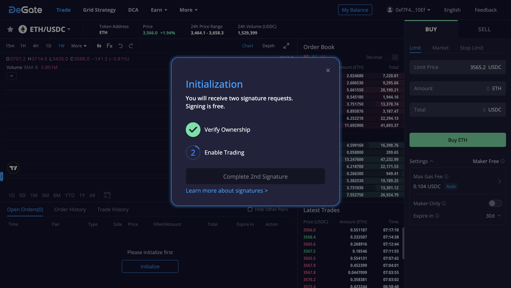
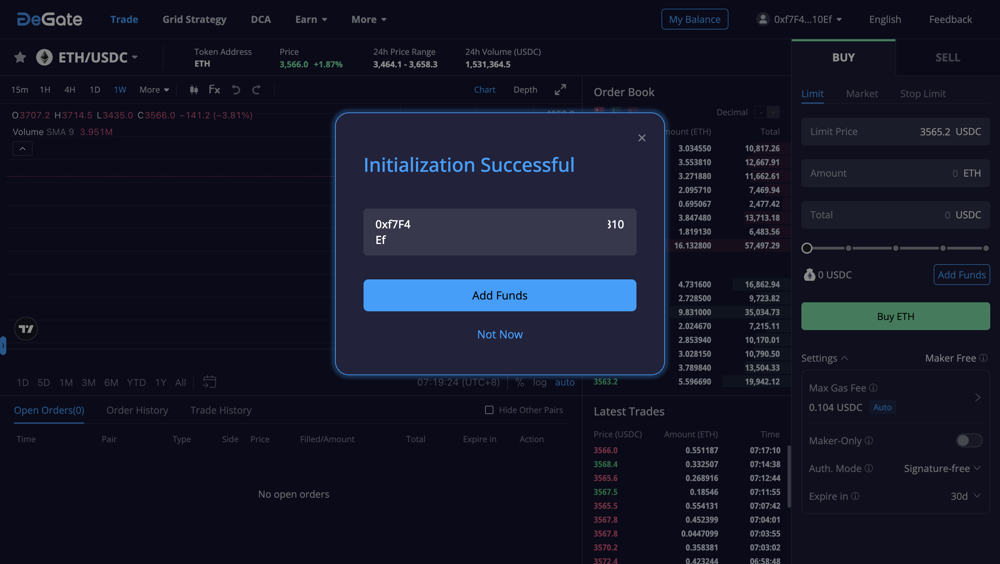

# MetaMask

## Connecting MetaMask to DeGate

1\.  Go to the Trade page: [https://app.degate.com/](https://app.degate.com/)

2\.  Press the "Connect Wallet" button.

<figure><figcaption></figcaption></figure>

3\.  Opt for MetaMask from the wallet choices.

<figure><figcaption></figcaption></figure>

4\.  The MetaMask application will pop up. Select the specific account you wish to use.

<figure><figcaption></figcaption></figure>

5\.  Give DeGate permission to see address, account balance, activity, and suggest transactions to approve.

<figure><figcaption></figcaption></figure>

6\.  In the top right corner of the page, locate the abbreviation of your address. Click on it to open a dropdown menu, then select and click the "initialize" button to proceed.

<figure><figcaption></figcaption></figure>

7\.  From the pop-up window, click the "Next" button to continue.

<figure><figcaption></figcaption></figure>

8\.  In the "Initialization" pop-up window, click the "Sign" button to sign the first signature request.

<figure><figcaption></figcaption></figure>

9\.  Sign the authorization message. Note: this signature does not initiate any transaction nor does it incur a gas fee.

<figure><figcaption></figcaption></figure>

10\.  On the DeGate page, you will see that the first signature request has been completed. Please go to the MetaMask application to sign the second signature request.

<figure><figcaption></figcaption></figure>

11\.  Sign the authorization message. Note: this signature does not initiate any transaction nor does it incur a gas fee.

<figure><figcaption></figcaption></figure>

 

<figure><figcaption></figcaption></figure>

12\.  Completed. Your wallet is now successfully initialized.

<figure><figcaption></figcaption></figure>
