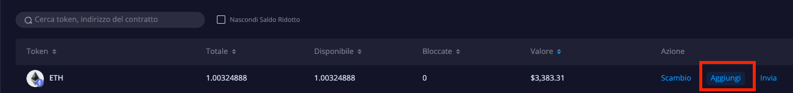
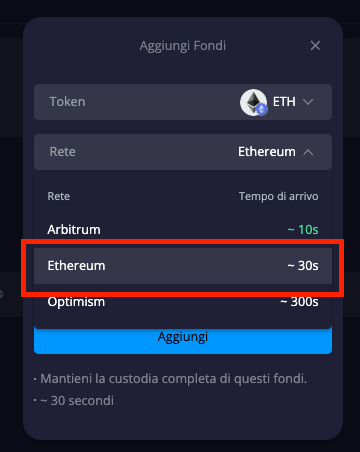
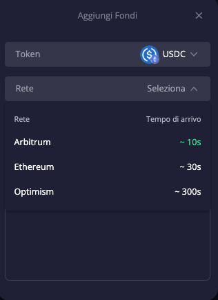
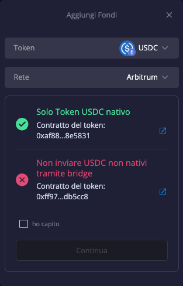
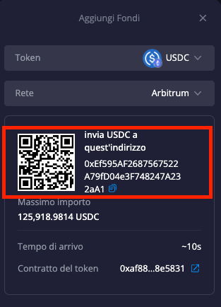

# Aggiungere Fondi su DeGate DEX

Su [DeGate DEX](https://app.degate.com/?utm_source=depositguidebook), ci sono 3 reti disponibili per l’aggiunta di fondi:

**Ethereum, Arbitrum, Optimism**

Aggiungere fondi tramite Arbitrum o Optimism consente di risparmiare sulle commissioni di gas. Tuttavia, il processo è diverso rispetto all’aggiunta di fondi su Ethereum. Tutti i processi sono semplici!

### **1. Aggiungere Fondi su Ethereum**

Quando utilizzi Ethereum per aggiungere fondi, è necessario avere un wallet self-custody sulla rete Ethereum e disporre di una quantità sufficiente di ETH per pagare le commissioni di gas.

Utilizzando la rete Ethereum, puoi aggiungere token ERC-20 al tuo saldo DeGate, non limitandoti a ETH o USDC.

#### **Passaggi per aggiungere fondi su Ethereum:**

1. Collega il tuo wallet e accedi all’app DeGate.
2. Nella pagina “Saldo DeGate”, trova il token che desideri trasferire su DeGate.
3. Clicca su “Aggiungi”.

Una finestra pop-up si aprirà.

4. Nel campo “Rete”, seleziona “Ethereum”.

Se stai aggiungendo un token **diverso da** ETH, USDC o USDT, vedrai solo “Ethereum” come rete disponibile.

5. Inserisci l’importo del token che desideri trasferire e clicca su “Aggiungi”.
6. Riceverai una notifica per firmare la transazione nel tuo wallet. Firma e attendi il completamento della transazione.

Dopo questi passaggi, potrai monitorare l’accreditamento su DeGate DEX e, in breve tempo, i fondi saranno visibili nel tuo saldo [DeGate](https://app.degate.com/?utm_source=depositguidebook).

### **2. Aggiungere Fondi su Arbitrum o Optimism**

Quando utilizzi Arbitrum o Optimism per aggiungere fondi, puoi farlo dal tuo wallet self-custody o da un CEX (exchange centralizzato). **Non è necessario** avere già un wallet self-custody.

L’aggiunta di fondi su Arbitrum o Optimism è disponibile solo per **ETH, USDC e USDT**.

#### **Passaggi per aggiungere fondi su Arbitrum o Optimism:**

1. Collega il tuo wallet e accedi all’app DeGate.
2. Nella pagina “Saldo DeGate”, trova il token (ETH, USDC o USDT) che desideri trasferire su DeGate e clicca su “Aggiungi”.
3. Una finestra pop-up si aprirà.

4. Nel campo “Rete”, seleziona la rete che desideri utilizzare, **Arbitrum** o **Optimism**.
5. La finestra mostrerà l’indirizzo del contratto del token accettato. Presta attenzione a questa informazione e verifica che il token che desideri aggiungere corrisponda all’indirizzo del contratto accettabile. Una volta confermato, clicca su “Ho capito”, e poi su “Continua”.

6. La finestra fornirà un indirizzo al quale inviare il tuo token, chiamato il tuo indirizzo associato. Copia questo indirizzo (è univoco per ogni utente) e usalo come destinatario della tua transazione di trasferimento.

**Esempio:**

Se scegli la rete Arbitrum e utilizzi un CEX per inviare USDC a DeGate:

1\. Sul CEX, effettua un prelievo di USDC utilizzando la rete Arbitrum.

2\. Copia il tuo indirizzo associato in DeGate come indirizzo del destinatario.

Lo stesso procedimento si applica alla rete Optimism.

Se utilizzi il tuo wallet privato per inviare i token, assicurati prima di aver configurato la rete Arbitrum o Optimism nel tuo wallet e di avere un po’ di ETH sulla rete per pagare le commissioni di gas.

• Per inviare fondi su **Arbitrum**, imposta la rete del tuo wallet su Arbitrum e procedi con la transazione.

• Per inviare fondi su **Optimism**, imposta la rete del tuo wallet su Optimism e procedi con la transazione.


**Non utilizzare Ethereum per inviare fondi al tuo indirizzo associato Arbitrum o Optimism su DeGate!**


Dopo aver effettuato la transazione, potrai monitorare il processo di accreditamento su DeGate DEX. In breve tempo, i fondi saranno visibili nel tuo saldo [DeGate](https://app.degate.com/?utm_source=depositguidebook).
