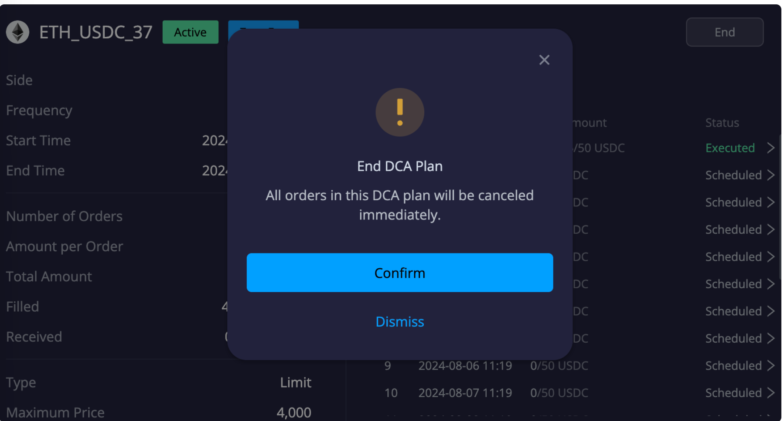

# DeGate DEXのDCAトレーディングボット

\
[DeGate](https://app.degate.com/?utm_source=dcaguidebook) DEXは、手数料無料モードで自動分散投資プラン（DCAプラン）を提供しています。DCAとは、ドルコスト平均法のことで、一定の頻度で一定額の資産を売買することです。例えば、毎週100ドル分のETHを購入します。時間の経過とともに、これは有利な平均購入価格または販売価格でポジションを構築することを可能にします。DCAは、時間の経過とともに価格変動を滑らかにし、歴史的に長期投資戦略として有効であることが証明されています。

ここでは、DCAプランの設定方法を紹介します。

例として、ETHのDCA買いプランの設定方法を見ていきましょう。

### **1.**[**app.degate.com**](http://app.degate.com/)**で、**[**DCA**](https://app.degate.com/dca/USDC/ETH/?utm_source=dcaguidebook)**ページに移動します。**

.png>)

### **2.パラメータを設定します。**

**1) 「ETHを購入」タブをクリックします。**\

**2)頻度を選択します。**

カスタムオプションでは、x時間ごと、またはx分ごとなど、頻度をカスタマイズできます。

\
**3)開始時刻と終了時刻を選択します。**

デフォルトでは、開始時刻は「今すぐ」になっています。カレンダーアイコンをクリックすると、開始時刻を将来の日時にカスタマイズできます。終了時刻は、DCAプランが停止する時刻です。

**4)注文ごとの金額を入力します。これは、各DCA注文で購入（または売却）する金額です。**

.png>)

### **3.手数料無料モード**

手数料無料モードでは、すべてのDCA注文がメイカーオンリーの指値注文として処理されるため、手数料はかかりません。ただし、注文がすぐに約定しない場合や、まったく約定しない場合もあることに注意してください。

手数料無料モードを有効にするかどうかを選択できます。有効にするには、右側のドットをクリックします。バーが青色に変わり、手数料無料が有効になっていることを示します。

詳細については、その横にある「i」アイコンにマウスを合わせてください。

### **4.価格制限**

価格制限を使用すると、DCAプランの最大購入価格または最小販売価格を制御できます。たとえば、ETHの価格が4000ドルを超えたときに購入しないようにするには、価格制限を設定して、すべての購入注文が4000ドル以下で実行されるようにすることができます。これを行うには、右側のドットをクリックし、「最大価格」バーに4000と入力します。

価格制限の詳細については、「価格制限」の横にある「i」アイコンにマウスを合わせてください。

### **5.推定額を確認します。**

必要なパラメータをすべて設定すると、DCAプランの推定注文数と合計金額が表示されます。DeGateの残高に合計金額と同額の資金を用意したり、ブロックしたりする必要はありませんが、DCA注文が執行されるたびに、少なくとも注文ごとの金額と同額の資金が利用可能である必要があります。

### **6.DCAプランを作成します。**

「DCAプランを作成」をクリックします。DCAプランの概要ウィンドウが表示されます。次に、「作成」をクリックします。これでDCAプランが設定されました。

手数料無料と価格制限を有効にしない場合、DCAプランの概要には注文タイプが「成行」と表示されます。これは、DCA注文が成行注文として執行されることを意味します。

### **7.DCAプランの詳細を表示します。**

DCAプランを有効にすると、いつでもその進捗状況と詳細を確認できます。

DeGate DEXのDCAページでは、下側にアクティブなDCAプランと終了したDCAプランが表示されます。強調表示されているボタンをクリックすると、プランの詳細を示すウィンドウがポップアップ表示されます。

.png>)

### **8.DCAプランを終了します。**

DCAプランを終了する場合は、「終了」をクリックし、「確認」をクリックします。

[DeGate DEX](https://app.degate.com/?utm_source=dcaguidebook)で利用可能なすべてのトークンに対して、DCAプランを開くことができます。

**DeGate DEXの主要なトークンのDCAページへのクイックリンク：**&#x20;

[DCA ETH](https://app.degate.com/dca/USDC/ETH/?utm_source=dcaguidebook)

[DCA wBTC](https://app.degate.com/dca/USDC/0x2260fac5e5542a773aa44fbcfedf7c193bc2c599/??utm_source=dcaguidebook)

[DCA LINK](https://app.degate.com/dca/USDC/0x514910771af9ca656af840dff83e8264ecf986ca/?utm_source=dcaguidebook)

[DCA GRT](https://app.degate.com/dca/USDC/0xc944e90c64b2c07662a292be6244bdf05cda44a7/?utm_source=dcaguidebook)

[DCA SOL](https://app.degate.com/dca/USDC/0xd31a59c85ae9d8edefec411d448f90841571b89c/?utm_source=dcaguidebook)

[DCA NEAR](https://app.degate.com/dca/USDC/0x1c88d38d04acd3edd9051ec587c67abff04bf30d/?utm_source=dcaguidebook)

[DCA ENS](https://app.degate.com/dca/USDC/0xc18360217d8f7ab5e7c516566761ea12ce7f9d72/?utm_source=dcaguidebook)

[DCA UNI](https://app.degate.com/dca/USDC/0x1f9840a85d5af5bf1d1762f925bdaddc4201f984/?utm_source=dcaguidebook)

[DCA LDO](https://app.degate.com/dca/USDC/0x5a98fcbea516cf06857215779fd812ca3bef1b32/?utm_source=dcaguidebook)

[DCA WLD](https://app.degate.com/dca/USDC/0x163f8c2467924be0ae7b5347228cabf260318753/?utm_source=dcaguidebook)

[DCA CRV](https://app.degate.com/dca/USDC/0xd533a949740bb3306d119cc777fa900ba034cd52/?utm_source=dcaguidebook)

[DCA ARB](https://app.degate.com/dca/USDC/0xb50721bcf8d664c30412cfbc6cf7a15145234ad1/?utm_source=dcaguidebook)

[DCA SHIB](https://app.degate.com/dca/USDC/0x95ad61b0a150d79219dcf64e1e6cc01f0b64c4ce/?utm_source=dcaguidebook)

[DCA PENDLE](https://app.degate.com/dca/USDC/0x808507121b80c02388fad14726482e061b8da827/?utm_source=dcaguidebook)

[DCA PEPE](https://app.degate.com/dca/USDC/0x6982508145454ce325ddbe47a25d4ec3d2311933/?utm_source=dcaguidebook)

[DCA MKR](https://app.degate.com/dca/USDC/0x9f8f72aa9304c8b593d555f12ef6589cc3a579a2/?utm_source=dcaguidebook)
