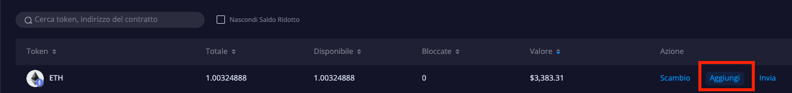
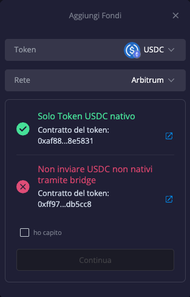
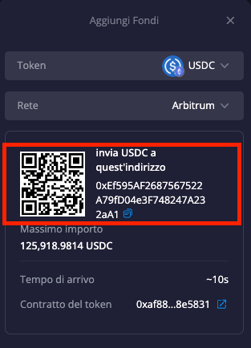
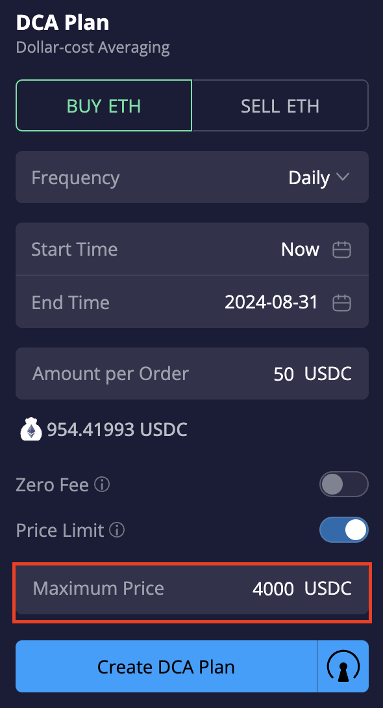

# DeGate DEX'te DCA Ticaret Botu

\
[DeGate](https://app.degate.com/?utm_source=dcaguidebook) DEX, Sıfır Ücret Modu ile otomatik bir merkeziyetsiz DCA Planı sunar. DCA (Dollar-Cost Averaging), belirli bir sıklıkta sabit bir miktarla bir varlık satın almak veya satmak anlamına gelir. Örneğin, her hafta 100$ değerinde ETH satın alırsınız. Zamanla, bu strateji size ortalama olarak daha uygun bir alım veya satım fiyatı sağlar. DCA, zamanla volatilite etkisini azaltır ve tarihsel olarak uzun vadede başarılı bir yatırım stratejisi olarak kanıtlanmıştır.

Bir DCA Planının nasıl kurulacağına dair rehber:

Örnek olarak ETH için bir DCA Alım planı kuralım.

### 1. [**http://app.degate.com**](http://app.degate.com/) **adresine gidin ve** [**DCA**](https://app.degate.com/dca/USDC/ETH/?utm_source=dcaguidebook) **sayfasına girin.**

<figure><figcaption></figcaption></figure>

### **2. Parametreleri ayarlayın**

**1) ETH AL sekmesine tıklayın**

**2) Bir Sıklık Seçin**

Özel seçeneğinde sıklığı her x saat veya dakikaya göre özelleştirebilirsiniz.

**3) Başlangıç ve Bitiş Zamanını Seçin**\
Varsayılan olarak, Başlangıç Zamanı planın oluşturulduğu andır. Takvim simgesine tıklayarak Başlangıç Zamanını gelecekteki bir tarih ve saat olarak özelleştirebilirsiniz. Bitiş Zamanı ise DCA Planınızın sonlanacağı zamandır.

**4) Emir Başına Miktarı Girin. Bu, DCA emri başına satın almak (veya satmak) için kullanacağınız miktardır.**

### **3. Sıfır Ücret Modu**

Sıfır Ücret Modu, her DCA emrini sadece limit emri (Maker) olarak işler, bu da herhangi bir ücret alınmadığı anlamına gelir. Ancak, emirlerinizin hemen doldurulamayabileceğini ya da hiç doldurulamayabileceğini unutmayın.

Sıfır Ücret Modunu etkinleştirip etkinleştirmemeyi seçebilirsiniz. Etkinleştirmek için sağdaki noktaya tıklayın; çubuk maviye döner, bu da etkinleştirildiğini gösterir.\
Daha fazla bilgi için imleci yandaki "i" simgesinin üzerine getirin.

### **4. Fiyat Limiti**

Fiyat Limiti, DCA Planınızda maksimum alım fiyatını veya minimum satış fiyatını kontrol etmenizi sağlar. Örneğin, ETH'nin fiyatı 4000$'ın üzerindeyken satın almak istemiyorsanız, Fiyat Limiti ayarlayarak tüm alım emirlerinizin 4000$ veya daha düşük bir fiyatta gerçekleştirilmesini sağlayabilirsiniz. Bunu yapmak için sağdaki butona tıklayın ve Maksimum Fiyat çubuğuna 4000 girin.

\
Fiyat Limiti hakkında daha fazla bilgi için imleci yandaki "i" simgesinin üzerine getirin.

### **5. Tahmini Miktarları Kontrol Edin**

Gerekli tüm parametreleri ayarladığınızda, DCA Planınız için tahmini Emir Sayısı ve Toplam Tutarı görüntüleyebilirsiniz. DeGate Bakiyenizde, Toplam Tutar kadar fon bulundurmanız gerekmez. Ancak her DCA emri gerçekleştiğinde en az Emir Başına Miktar kadar kullanılabilir fona sahip olmanız gerekir.

### **6. DCA Planı Oluşturun**

DCA Planı Oluştur'a tıklayın. DCA Planınızın bir özet penceresi açılacaktır; ardından Oluştur'a tıklayın. Artık DCA Planını kurdunuz!

\
Sıfır Ücret ve Fiyat Limiti'ni etkinleştirmezseniz, DCA Planı özetinizde Emir Türü "Piyasa" olarak görünecektir, yani DCA emirleriniz Piyasa Emirleri olarak gerçekleştirilecektir.

### **7. DCA Planının Detaylarını Görüntüleyin**

Bir DCA Planını etkinleştirdikten sonra her zaman ilerlemesini ve detaylarını kontrol edebilirsiniz.\
DeGate DEX'in DCA sayfasında, Aktif ve Tamamlanmış DCA Planlarınızı alt kısımda bulacaksınız. Planınızın detaylarını gösteren bir pencere açmak için vurgulanan butona tıklayın.

### **8. DCA Planını Sonlandırın**

DCA Planını sonlandırmak istediğinizde, sadece Sonlandır'a ve ardından Onayla'ya tıklayın.

\
[DeGate DEX'te](https://app.degate.com/?utm_source=dcaguidebook) mevcut olan tüm tokenlar için DCA Planı oluşturabilirsiniz.

**DeGate DEX'te önde gelen tokenların DCA sayfalarına hızlı bağlantılar:**

[DCA ETH](https://app.degate.com/dca/USDC/ETH/?utm_source=dcaguidebook)

[DCA wBTC](https://app.degate.com/dca/USDC/0x2260fac5e5542a773aa44fbcfedf7c193bc2c599/??utm_source=dcaguidebook)

[DCA LINK](https://app.degate.com/dca/USDC/0x514910771af9ca656af840dff83e8264ecf986ca/?utm_source=dcaguidebook)

[DCA GRT](https://app.degate.com/dca/USDC/0xc944e90c64b2c07662a292be6244bdf05cda44a7/?utm_source=dcaguidebook)

[DCA SOL](https://app.degate.com/dca/USDC/0xd31a59c85ae9d8edefec411d448f90841571b89c/?utm_source=dcaguidebook)

[DCA NEAR](https://app.degate.com/dca/USDC/0x1c88d38d04acd3edd9051ec587c67abff04bf30d/?utm_source=dcaguidebook)

[DCA ENS](https://app.degate.com/dca/USDC/0xc18360217d8f7ab5e7c516566761ea12ce7f9d72/?utm_source=dcaguidebook)

[DCA UNI](https://app.degate.com/dca/USDC/0x1f9840a85d5af5bf1d1762f925bdaddc4201f984/?utm_source=dcaguidebook)

[DCA LDO](https://app.degate.com/dca/USDC/0x5a98fcbea516cf06857215779fd812ca3bef1b32/?utm_source=dcaguidebook)

[DCA WLD](https://app.degate.com/dca/USDC/0x163f8c2467924be0ae7b5347228cabf260318753/?utm_source=dcaguidebook)

[DCA CRV](https://app.degate.com/dca/USDC/0xd533a949740bb3306d119cc777fa900ba034cd52/?utm_source=dcaguidebook)

[DCA ARB](https://app.degate.com/dca/USDC/0xb50721bcf8d664c30412cfbc6cf7a15145234ad1/?utm_source=dcaguidebook)

[DCA SHIB](https://app.degate.com/dca/USDC/0x95ad61b0a150d79219dcf64e1e6cc01f0b64c4ce/?utm_source=dcaguidebook)

[DCA PENDLE](https://app.degate.com/dca/USDC/0x808507121b80c02388fad14726482e061b8da827/?utm_source=dcaguidebook)

[DCA PEPE](https://app.degate.com/dca/USDC/0x6982508145454ce325ddbe47a25d4ec3d2311933/?utm_source=dcaguidebook)

[DCA MKR](https://app.degate.com/dca/USDC/0x9f8f72aa9304c8b593d555f12ef6589cc3a579a2/?utm_source=dcaguidebook)
