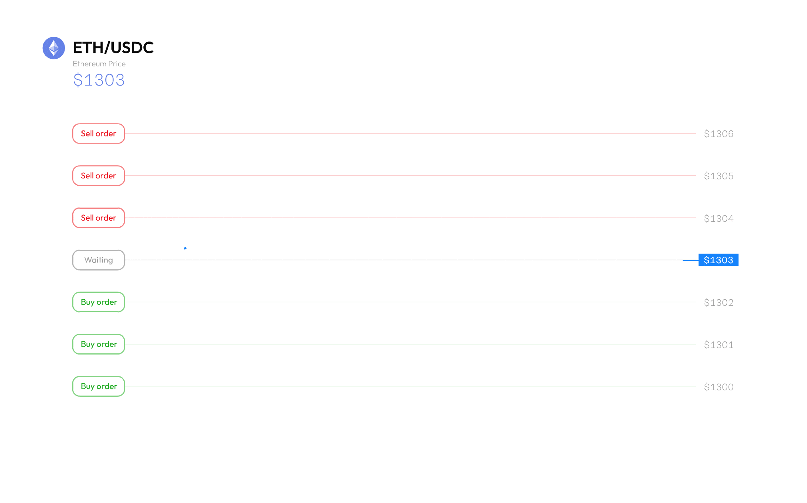
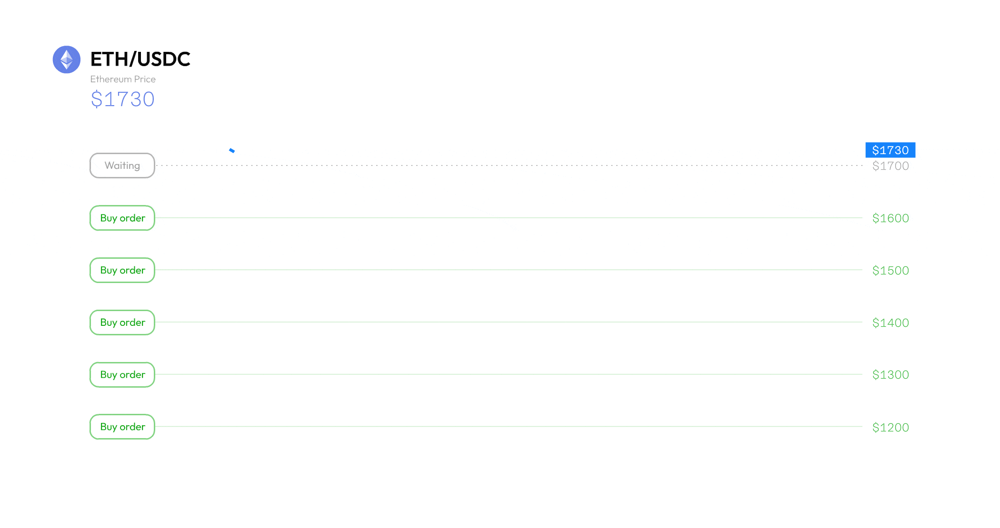
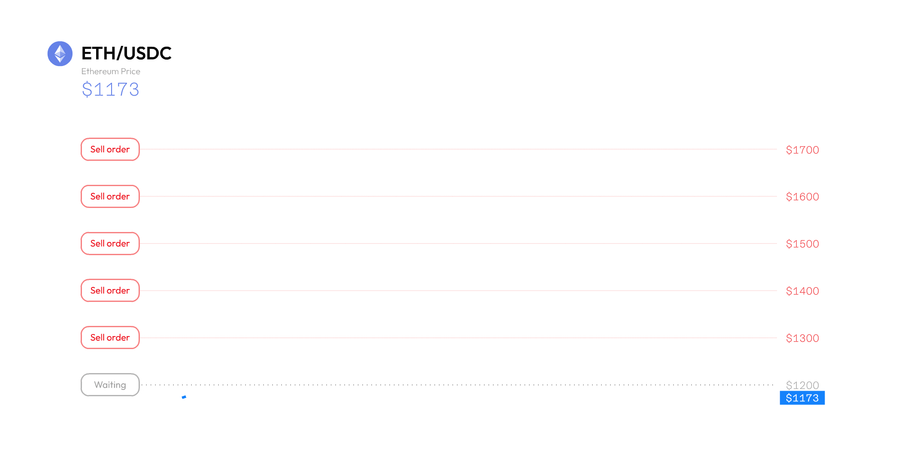

# Децентралізована Grid стратегія сітки

### **Що таке Grid стратегія сітки?**

Стратегія сітки, або grid trading, є торговим механізмом, який автоматизує купівлю та продаж у визначеному діапазоні. Вона дозволяє вам розміщувати серію ордерів на купівлю та продаж у вказаному ціновому діапазоні; коли виконується ордер на купівлю, він миттєво розміщує інший ордер на продаж на вищому рівні сітки, і навпаки. Стратегія сітки найкраще працює на бічних ринках, коли ціни коливаються в межах визначеного діапазону, дозволяючи вам отримувати прибуток від невеликих змін цін.

На [DeGate DEX](https://app.degate.com/?utm_source=gridguidebook) ви можете виконувати децентралізовану [Grid стратегію сітки](https://app.degate.com/en/grid/USDC/ETH/?utm_source=gridguidebook) без комісій у форматі самостійного зберігання активів (self-custody).



Сіткова Grid стратегія у дії, купує за нижчою ціною та продає за вищою

### **Переваги сіткової Grid стратегії** 

**Стратегія грід** користується популярністю серед трейдерів, які не мають часу чи можливості постійно стежити за ринком. Серед основних переваг цієї стратегії можна виділити наступні:

1. **Автоматизація**\
   Спочатку визначаються верхні та нижні межі ціни, після чого ордери на купівлю/продаж розміщуються та виконуються автоматично відповідно до змін цін на актив. Стратегія грід працює цілодобово, постійно купуючи за низькою ціною і продаючи за високою, що генерує пасивний дохід для трейдерів.
2. **Адаптивність**\
   Щільність грід-ордерів можна оптимізувати під різні ринкові умови. У короткостроковій перспективі можна налаштувати сотні грід-ордерів для отримання мікро прибутків від щоденних коливань цін; у довгостроковій перспективі ширший діапазон дозволяє отримувати прибуток від загального руху цін у бічному тренді.
3. **Прибутковість**\
   Грід-торгівля демонструє найкращі результати на бічних ринках, коли немає чіткого тренду. Трейдеру не потрібно прогнозувати, чи піде ціна активу вгору або вниз, і після активації стратегії грід не потрібно втручатися, окрім як для моніторингу результатів.

### **Виклики у розробці децентралізованої сіткової Grid стратегії** 

Функціонал стратегії ґрід зазвичай використовується на централізованих біржах (CEX), де торгівля здійснюється легше, оскільки користувачі не контролюють свої кошти. На ринку поки що немає децентралізованих протоколів для торгівлі за сітковою Grid стратегією через кілька причин:

1. **Підпис гаманця**\
   Звичайна стратегія грід може складатися з 2 до 200 рівнів грід-ордерів, залежно від налаштувань користувача. Кожен рівень ґрід є окремим ордером на купівлю або продаж, який потребує підпису користувача. При цьому авторизація підпису може займати кілька секунд, що впливає на виконання ордерів у ринкових умовах, де ціни змінюються за мікросекунди.
2. **Підпис у режимі реального часу**\
   У реальних ринкових умовах ціни можуть різко змінюватися протягом короткого часу. Це вплине на ґрід-ордери, які можуть миттєво змінюватися з ордерів на купівлю в ордери на продаж і навпаки. Ці зворотні ордери потребують авторизації підпису в реальному часі, що може бути складно, якщо користувач не біля комп'ютера.

#### **Вступ до децентралізованої стратегії грід** 

Щоб створити децентралізовану стратегію ґрід, спочатку слід визначити постійні величини стандартного налаштування:

* **Сума на рівень**: активи, виділені для кожного рівня грід, за даними користувача.
* **Зсув грід**: різниця між кожним рівнем грід, визначається діапазоном цін і кількістю рівнів.
* **Зсув ордера**: різниця між кожним ордером для розрахунку зворотних ордерів.

Налаштування стратегії грід розбивається на дві категорії:

1. **Грід на купівлю** — налаштування ордерів на купівлю.
2. **Грід на продаж** — налаштування ордерів на продаж.

#### **Підписи для гріду** 

Наступним кроком є налаштування підписів транзакцій для кожного грід-рівня покупки/продажу. Раніше визначені константи об'єднуються в кожен підпис транзакції гріду. Критично важливо, що підпис транзакції буде прив'язаний до першого грід-ордера, який визначається як грід, найближчий до поточної ринкової ціни, і наступні грід-ордера будуть налаштовуватися відповідно до авторизації підпису з першого грід-ордера.

Наприклад, поточна ринкова ціна ETH становить $2000.\
Для **гріду на купівлю** перший грід-ордер ("Купити 1") визначається на найближчому рівні гріду < $2000,\
Для **гріду на продаж** перший грід-ордер ("Продати 1") визначається на найближчому рівні гріду > $2000.

По суті, це вирішує необхідність для користувача підписувати кілька транзакцій під час активної роботи стратегії грід.

#### **Приклад: ETH/USDC** 

Користувач A налаштовує ручну стратегію грід для пари ETH/USDC у діапазоні $1800 - $2300, коли поточна ціна ETH становить $2050. Додається 10 грід-ліній із розподіленими активами: 0,5 ETH і 950 USDC.

Як результат, відповідно до введених параметрів налаштовуються 5 грід на продаж і 5 грід на купівлю.

Для гріду на продаж користувачеві потрібно затвердити та підписати "Підпис транзакції грід на продаж" на першому рівні гріду на продаж (відомий як "Продати 1"), що дозволить механізму стратегії грід налаштувати подальші ордери на продаж.

Для гріду на купівлю користувачеві потрібно затвердити та підписати "Підпис транзакції грід на купівлю" на першому рівні гріду на купівлю (відомий як "Купити 1"), що дозволить механізму стратегії грід налаштувати подальші ордери на купівлю.

Користувач може просто відпочити і спостерігати, як стратегія грід виконує різні ордери (фактично купуючи за низькою ціною і продаючи за високою), що генерує пасивний прибуток для користувача!


Завдяки цьому інноваційному технічному рішенню, користувачі тепер можуть насолоджуватися перевагами грід-торгівлі та одночасно повністю контролювати свої активи.


<figure><figcaption></figcaption></figure>

### **Стратегії для сіткової Grid торгівлі** 

Існує 3 поширені стратегії, які використовуються в сітковій grid торгівлі, що в основному залежать від ринкових трендів і продуктивності базового активу.

#### **Нормальна грід-стратегія**

Ця стратегія найкраще підходить для використання на волатильному ринку, де базовий актив консолідується або рухається в діапазоні. Завдяки нормальній грід-стратегії трейдер може встановити як ордери на покупку, так і на продаж у заздалегідь визначеному ціновому діапазоні, ефективно отримуючи пасивний прибуток від коливань ціни активу.

#### **Стратегія Buy Grid** 

Ця стратегія найкраще підходить для використання на падаючому ринку, де ціна базового токена може знизитися ще більше. Використовуючи стратегію Buy Grid, трейдер може встановити серію ордерів на купівлю **нижче** ринкової ціни, що дозволяє йому купувати актив за низькою ціною. Крім того, ордери будуть переведені на продаж, якщо ціна відскочить, що дозволить трейдеру отримати прибуток у межах грідового діапазону.

Основна ідея стратегії Buy Grid полягає в тому, що базовий токен має хороший потенціал, що підходить для довгострокового утримання, що дозволяє трейдеру вигідно середньоарифметично накопичувати токен, навіть якщо його ціна виходить за межі грідового діапазону.

#### **Стратегія Sell Grid** 

Ця стратегія схожа на стратегію Buy Grid, але діє в протилежному напрямку. Стратегія Sell Grid найкраще підходить для використання на зростаючому ринку, де базовий токен буде продовжувати зростати. Використовуючи стратегію Sell Grid, трейдер може встановити серію ордерів на продаж **вище** ринкової ціни, що дозволяє йому продавати актив за високою ціною. Крім того, ордери будуть переведені на купівлю, якщо ціна впаде, що дозволить трейдеру отримати прибуток у межах грідового діапазону.

Основна перевага стратегії Sell Grid полягає в тому, що трейдер зможе поступово фіксувати прибуток, коли ціна базового токена піднімається, максимізуючи прибуток на підйомі та купуючи назад, коли ціна токена знижується.

### **Висновок** 

Сіткова Grid торгівля — це автоматизована торгова стратегія, яка не піддається впливу людських емоцій і повністю визначається кодом. Ця стратегія найкраще працює на ринку з боковим трендом, генеруючи пасивний дохід для користувачів без необхідності постійно слідкувати за екраном.

Крім того, завдяки використанню децентралізованого дизайну [DeGate](https://app.degate.com/?utm_source=gridguidebook) у своїй грідовій стратегії, користувачі тепер мають повний контроль над своїми коштами, насолоджуючись перевагами автоматизованої торгівлі. Завдяки широкому спектру функцій [DeGate](https://degate.com/?utm_source=gridguidebook), таких як лімітні ордери та децентралізована сіткова Grid торгівля, користувачі нарешті можуть спокійно спати, незалежно від ринкових умов.

### **Посібник з Сіткової Grid Стратегії** 

Сіткова Grid Стратегія або грід трейдинг — це потужний торговий інструмент, що автоматизує купівлю та продаж у визначеному діапазоні. Грід стратегія автоматично виставляє ордери на купівлю, коли ціни падають, і на продаж, коли вони зростають, що дозволяє вам отримувати прибуток від коливань ринку.

**Як налаштувати Грід Стратегію на DeGate?**

Розглянемо приклад використання пари ETH/USDC.

.png>)

### **Вибір режиму Грід Стратегії**

Є два режими Грід Стратегії на вибір:

* **Авто**: Налаштуйте Грід Стратегію за допомогою автоматично згенерованих параметрів, рекомендованих системою.
* **Ручний**: Налаштуйте параметри Грід Стратегії відповідно до ваших вподобань.

Для новачків у Грід Стратегії рекомендується починати з режиму \[Авто].

.png>)

.png>)

#### **Налаштування Грід Стратегії \[АВТО]**

1. Натисніть на вкладку \[Авто].
2. Введіть суму для розподілу в Грід Стратегію \[ETH/USDC]. Введіть суму ETH або USDC, і система розрахує відповідну суму для Грід Стратегії.

Переконайтеся, що у вас достатньо ETH і USDC на балансі DeGate.

.png>)

3. Будуть відображені рекомендовані параметри.
4. Натисніть "Створити Grid Стратегію", щоб завершити налаштування та почати заробляти.

.png>)

.png>)

**Налаштування Грід Стратегії \[РУЧНИЙ]**

1. Натисніть на вкладку \[Ручний]. Ви можете змінити параметри для вашої індивідуальної Грід Стратегії.
2. **Діапазон цін**: Верхня і нижня межа цін визначають діапазон цін, у якому буде діяти Грід Стратегія.
3. **Початковий розподіл**: Сума коштів, що буде виділена для Грід Стратегії. Введіть суму ETH або USDC, і система розрахує відповідну суму.
4. **Кількість сіток**: Кількість ордерів на купівлю та продаж, які Грід Стратегія виставить у межах діапазону цін.
5. **Кількість на сітку (≥ $50)**: Сума ETH, що буде виділена для кожного ордера сітки.
6. Натисніть "Створити Grid Стратегію", щоб завершити налаштування та почати заробляти.

Є мінімальна вимога до розміру ордера в розмірі $50 для кожного грід-ордера сітки.

.png>)

Для оптимальної прибутковості рекомендується налаштувати Сіткову Грід Стратегію так, щоб поточна ринкова ціна знаходилася в межах діапазону цін.
