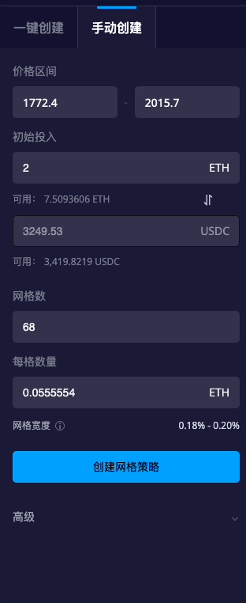
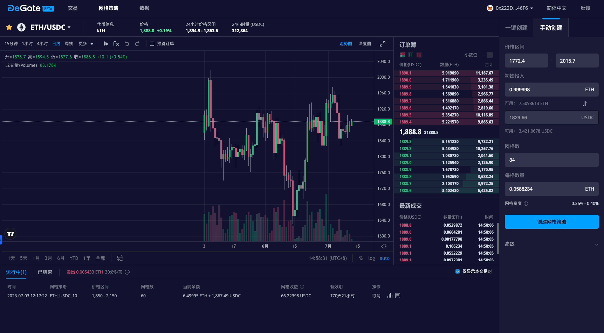

# 创建一个网格策略

网格策略是一种强大的工具，允许用户在在一定价格范围内自动进行买入和卖出操作，利用价格波动获利。如果操作得当，网格策略会是一种非常有效的方法，通过反复低买高卖来赚取利润。根据以下教程步骤，开始在DeGate上的网格交易吧。&#x20;

## 如何在DeGate上创建网格策略？

### **1. 点击**[**网格策略**](https://app.degate.com/grid/USDC/ETH)

<figure><figcaption></figcaption></figure>

### 2. 搜索并选择您想交易的交易对，例如ETH/USDC

<figure><figcaption></figcaption></figure>

### 3. 选择\[一键创建]或\[手动创建]来设置网格策略参数。&#x20;

#### 一键创建模式

一键创建模式将自动选择并填充网格参数字段。您只需要输入`初始投入`字段即可。&#x20;

此外，您也可以使用一键创建模式来获取初始的推荐参数。然后，点击\[**把参数填入手动创建**]，以在手动创建模式下预先填写这些参数，再根据您的实际需求进行调整。

<figure><figcaption></figcaption></figure>

#### 手动创建模式&#x20;

在手动模式下，您可以根据您的偏好自定义网格策略参数，包括`价格区间`、`初始投入`、`网格数`、`每格数量`和`有效期`。

**如何设置网格策略参数**

价格区间：指的是在网格交易中设定的买入和卖出订单的价格范围。你可以设置一个最低价格和一个最高价格，交易将在这个价格范围内进行。网格订单不会超出这个范围。选择一个合理的价格范围，不要过于宽泛，相信市场价格会在其内波动，这将带来稳定的回报。

初始分配：指的是网格交易策略开始时所锁定的初始资金。

网格数：指的是价格区间内设置的网格数量，也可以理解为买入和卖出订单的总数量。网格数越多，交易频率和成交量也会相应增加。网格订单的最小数量为2个，最大数量为255个。

每格数量：指的是每个网格订单的买入或卖出数量，每格数量是固定的，对于所有网格都相同

网格宽度：这是决定网格策略盈利能力的重要参数。网格宽度=（卖出价格-买入价格）/卖出价格。增加网格宽度可以增强每个“低买高卖”交易的利润，但也可能减少在价格波动期间执行的订单数量。

有效期：网格策略将会在有效期到期时会自动过期，并自动取消网格订单。默认的有效期为180天，最大值为365天。

为了方便起见，系统将根据当前最新价格自动填写价格区间的上限和下限。您可以根据自己的需求进行二次修改。

<figure><figcaption></figcaption></figure>

在所有参数设置完成后，如果您修改了任何值，其他值将自动进行相应调整。如果某个参数不符合创建网格的条件，下方将显示红色警告通知。请注意，每个网格数量对应的资金必须大于100美元。

<figure><figcaption></figcaption></figure>

#### 预览订单&#x20;

通过勾选\[**预览订单**]复选框，您可以在K线图上预览即将创建的网格订单。

<figure><figcaption></figcaption></figure>

### 4. 创建网格策略&#x20;

确认参数后，点击\[**创建网格策略**]按钮。在弹出窗口中再次查看参数，并点击\[**确认**]以成功创建网格策略。

详细信息的弹窗将自动打开，显示网格策略的状态，并提供有关网格收益、待成交订单和网格参数的信息。您可以通过在界面底部的\[**运行中**]列表访问相应策略，重新打开详细信息的弹窗。

<figure><figcaption></figcaption></figure>

## 取消网格策略&#x20;

您可以从界面底部的\[**运行中**]列表中选择要关闭的网格策略。点击\[**取消**]按钮即可关闭所选的网格策略。

<figure><figcaption></figcaption></figure>

您还可以通过详细信息弹出窗口内的\[**取消策略**]按钮来关闭网格策略。

<figure><figcaption></figcaption></figure>

关闭后，网格策略将出现在界面底部的\[**已完成**]列表中。您可以在此处查看已关闭网格策略的详细信息，并复制已关闭网格的参数，以便轻松地再次创建相同的的网格。

## 了解 DeGate 网格策略背后的原理&#x20;

请参阅以下链接，简明概述网格策略的原理和技术实现。&#x20;

[https://docs.degate.com/v/product\_zh/main-features/grid-strategy](https://docs.degate.com/v/product\_zh/main-features/grid-strategy)[https://docs.degate.com/v/product\_zh/advanced/decentralized-grid-strategy](https://docs.degate.com/v/product\_zh/advanced/decentralized-grid-strategy)

