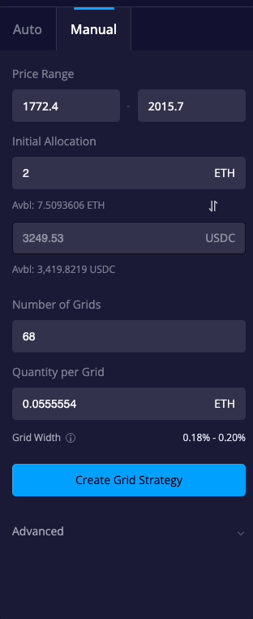
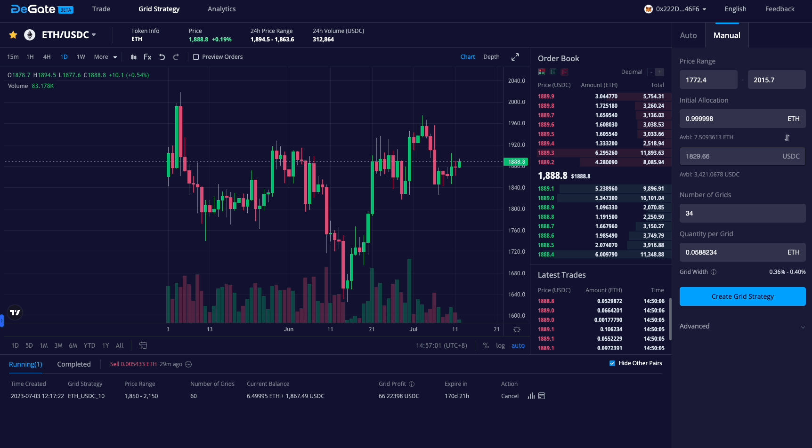

# Create a Grid Strategy

The Grid Strategy is a powerful tool that allows users automatically buy and sell between a token pair within a set price range, taking advantage of price fluctuations. If done right, grid strategy is one of the most powerful ways to earn profit by repeatedly buying low and selling high. Follow the step-by-step guide below to start grid trading on DeGate.

## How to create a Grid Strategy on DeGate

### 1. Click [Grid Strategy](https://app.degate.com/grid/).&#x20;

<figure><figcaption></figcaption></figure>

### 2. Go to trading pair you want to set up a grid for, e.g. ETH/USDC

<figure><figcaption></figcaption></figure>

### 3. Select **\[Auto]** or **\[Manual]** to set up Grid Strategy parameters.

#### Auto Mode

The Auto mode will automatically populate the grid parameter fields. You will only need to input the **`Initial Allocation`** field.

You also have the option to use the Auto Mode to obtain initial recommended parameters. You can then click on **\[Copy parameters to Manual]** to pre-fill those parameters in Manual Mode and adjust them according to your needs.

<figure><figcaption></figcaption></figure>

#### Manual Mode

In manual mode, you can customize the grid strategy parameters according to your preferences, including **`Price Range`**, **`Initial Allocation`**,**`Number of Grids`** , **`Quantity per Grid`** and **`Expire in`**.

#### How to setup Grid Strategy parameters?

1. **Price range**: This refers to the lowest and the highest prices you want to trade within. No grid orders will exceed the range. Picking a sensible price range that is not too wide, that you believe the market price will fluctuate within for as long as possible will lead to stable returns.&#x20;
2. **Initial allocation**: This is the initial funds locked to run a strategy.&#x20;
3. **Number of grids**: This is the number of grid orders running simultaneously within your grid strategy. The minimum number of grid orders is 2, and the maximum is 255.
4. **Quantity per grid**: This is the quantity to be bought or sold per grid order, which is the same for all grid orders.
5. **Grid Width**: This is an important parameter that determines a grid strategy's profitability. Grid Width = (Sell Price - Buy Price) / Sell Price. The increase in grid width can enhance the profit from each "low buy" and "high sell", but it can also decrease the number of orders executed during price fluctuations.
6. **Expire in**: The grid strategy automatically expires when the validity period elapses, and grid orders are automatically cancelled. The default validity period is 180 days, and the maximum is 365 days.

For convenience, the system will automatically populate the upper and lower limits based on the current latest price. You can modify it according to your needs.

<figure><figcaption></figcaption></figure>

Once all the parameters are set, if you modify any value, the other values will automatically adjust accordingly. If the parameters do not meet the conditions for creating a grid, a red warning notice will appear below. Please note that the quantity per grid needs be greater than the equivalent of $100.

<figure><figcaption></figcaption></figure>

#### Preview Orders

By checking the **\[Preview Orders]** checkbox, you can preview the grid orders that are about to be created on the candlestick chart on the left.

<figure><figcaption></figcaption></figure>

### 4. Create Grid Strategy

Once you confirm the parameters, click the **\[Create Grid Strategy]** button. In the popup that appears, review the parameters again and click **\[Confirm]** to successfully create the grid strategy.&#x20;

The details popup will automatically open, showing the status of the grid strategy and providing information on profit, orders, and parameters. You can reopen the details popup by accessing the corresponding strategy's action in the **\[Running]** list at the bottom of the interface.

<figure><figcaption></figcaption></figure>

## Cancel a Grid Strategy&#x20;

You can select the grid strategy you want to close from the **\[Running]** list at the bottom of the interface. Click the **\[Cancel]** button to close the selected grid strategy.

<figure><figcaption></figcaption></figure>

You can also close the grid strategy by clicking the **\[Cancel Strategy]** button inside the details popup.

<figure><figcaption></figcaption></figure>

After closing the strategy, the grid strategy will appear in the **\[Completed]** list at the bottom of the interface. You can view the details of the closed grid strategy here and copy the parameters of the closed grid for easy creation of a new grid.

<figure><figcaption></figcaption></figure>

## Understanding the principles behind Grid Strategy

Please see the links for a concise overview of the grid strategy's principles and technical implementation.

[https://docs.degate.com/v/product\_en/main-features/grid-strategy](https://docs.degate.com/v/product\_en/main-features/grid-strategy)\
[https://docs.degate.com/advanced/decentralized-grid-strategy](https://docs.degate.com/advanced/decentralized-grid-strategy)
