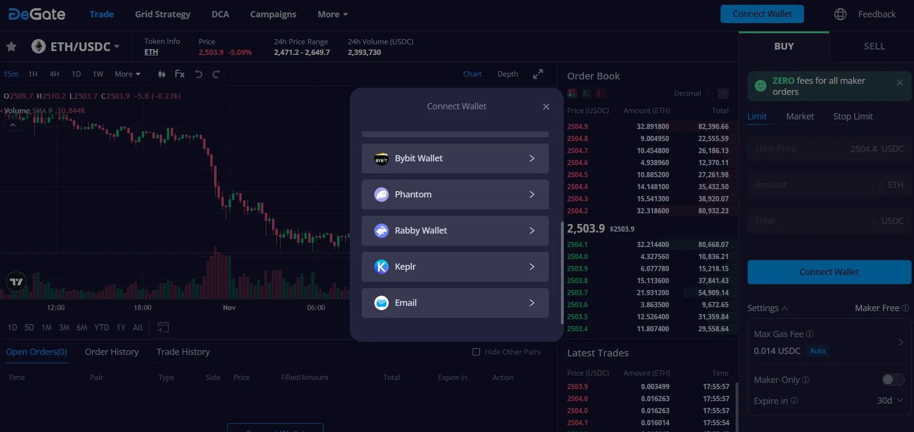

# Grid Strategy Creation Guide

Grid strategy is a powerful tool that can capitalize on market fluctuations within a predetermined price range. A grid strategy sets multiple buy and sell orders to automatically buy low and sell high for profit.

How do we create a grid strategy on DeGate? Let's work through a guided example below.

First, open [DeGate DEX](https://app.degate.com/), click on "[Grid Strategy](https://app.degate.com/grid/USDC/ETH)" at the top of the page, then search and select the trading pair you wish to trade, such as ETH/USDC.

<figure><figcaption></figcaption></figure>

<figure><figcaption></figcaption></figure>

Let's assume that the ETH price is 1303 USDC. Let's choose the ETH/USDC trading pair to create a grid.&#x20;

* Enter price range. In this example we will set a grid in the range of 1200 - 1400 USDC

<figure><figcaption></figcaption></figure>

* Enter Initial Allocation (the total amount you want to invest). In this example, we'll allocate 97 ETH, the system will automatically calculate the equivalent amount in USDC

<figure><figcaption></figcaption></figure>

* Set grid density: let's set the number of grids to 200, the system will automatically calculate the quantity per grid.

<figure><figcaption></figcaption></figure>

After successfully creating the grid strategy, the DeGate system will set multiple buy and sell limit orders within the price range.

<figure><figcaption></figcaption></figure>

The grid robot will continuously buy low and sell high within the set price range to automatically generate profits, as illustrated in the diagram below:

<figure><figcaption></figcaption></figure>

After completing one buy low and sell high cycle, you will profit 1 USDC.

**Note:**

For each grid strategy, in this case the ETH/USDC grid strategy example above, please ensure that the current market price is within the range you set (1200-1400), otherwise, the grid strategy will no longer generate profits.
