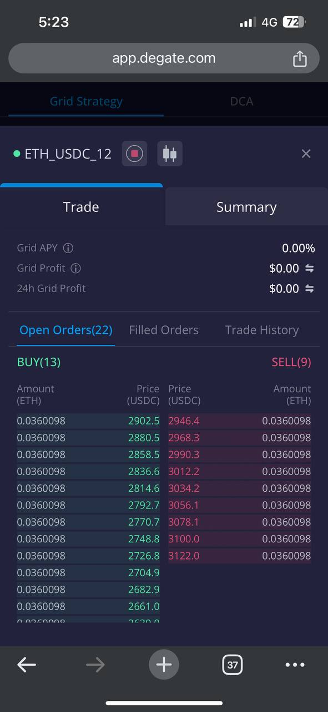

# Grid Strategy Guidebook (Mobile)

Grid Strategy or grid trading is a powerful trading tool that automates buying and selling within a defined range. A grid strategy automatically places _buy_ orders when prices drop and _sell_ orders when they rise, allowing you to capitalize on market fluctuations and generate profits. &#x20;

### How to set up Grid Strategy on DeGate?&#x20;

Select "Advanced" at the bottom of the navigation panel -> Select "Create Grid Strategy" after. We will be using ETH/USDC pair in the guided example below.

#### **Select Grid Strategy mode**

There are 2 Grid Strategy modes to choose from.

**Auto:** Set up Grid Strategy using auto-generated parameters recommended by the system.

**Manual:** Customize Grid Strategy parameters to match your preferences.


For newcomers to Grid Strategy, it is recommended to start with \[Auto] mode.


<figure><figcaption></figcaption></figure>

 

<figure><figcaption></figcaption></figure>

#### **Set up Grid Strategy \[AUTO]**

1. Click the \[Auto] tab
2. Enter the amount to allocate for Grid Strategy \[ETH/USDC].  Input either ETH or USDC amount and the system will calculate the corresponding amount for the Grid Strategy.&#x20;
3. The recommended parameters will be displayed.&#x20;
4. Click "Create Grid Strategy" to complete setup and start earning.&#x20;


Do ensure you have sufficient ETH and USDC in your DeGate balance. You can preview your orders before setting up Grid Strategy.&#x20;


<figure><figcaption></figcaption></figure>

 

<figure><figcaption></figcaption></figure>

 

<figure><figcaption></figcaption></figure>

#### **Set up Grid Strategy \[MANUAL]**

1. Click on \[Manual] tab. You can modify the parameters for your customized Grid Strategy.
2. Price Range: The upper and lower limit prices define the price range in which the Grid Strategy will run.&#x20;
3. Initial Allocation: The amount of funds to allocate for Grid Strategy. Input either ETH or USDC amount and the system will calculate the corresponding amount.
4. Number of Grids: The number of buy and sell orders the Grid Strategy will place within the Price Range.
5. Quantity per Grid(>$100): The amount of ETH allocated for each grid order.
6. Click "Create Grid Strategy" to complete setup and start earning.&#x20;


There is a minimum order size requirement of $100 for each grid order.


<figure><figcaption></figcaption></figure>

 

<figure><figcaption></figcaption></figure>

 

<figure><figcaption></figcaption></figure>


For optimal profitability, it is recommended to set up the Grid Strategy such that the current market price falls within the price range.

