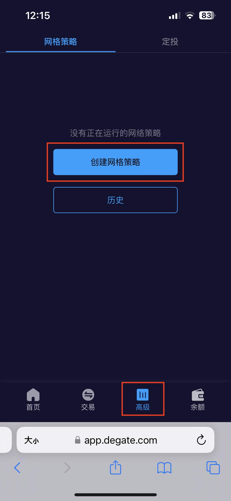
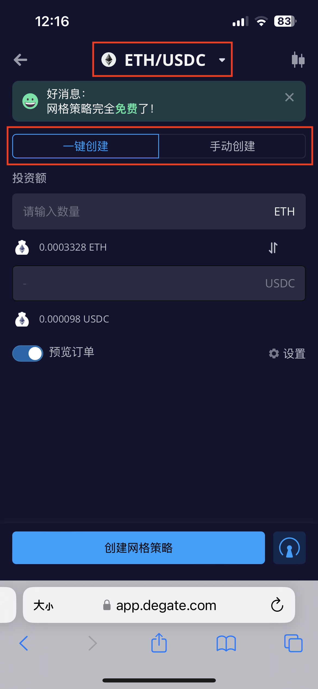

# 网格策略指南（移动版）

网格策略或网格交易是一种强大的交易工具，可以在设定的区间内进行自动化买卖。网格策略在下跌时自动下达_买入_订单，在上涨时自动下达_卖出_订单，让您能够利用市场波动获得收益。

## 如何在DeGate上设置网格策略？

选择页面底部导航栏的“高级”-> 然后选择“创建网格策略”。以下将使用 ETH/USDC交易对为例。

### **选择网格策略模式**&#x20;

有2种网格策略模式可供选择。

**一键创建**：使用系统推荐的自动生成的参数设置网格策略&#x20;

**手动创建**：自定义网格策略参数以匹配您的偏好&#x20;


对于网格策略的新手来说，建议从\[一键创建]模式开始。


<figure><figcaption></figcaption></figure>

 

<figure><figcaption></figcaption></figure>

### **设置网格策略\[一键创建]**&#x20;

1. 点击一键创建
2. 输入用于网格策略 \[ETH/USDC] 的初始投入金额。输入 ETH 或 USDC金额，系统将自动计算出另一种代币对应所需的数量。
3. 将显示推荐的网格参数。&#x20;
4. 点击“创建网格策略”完成设置并开始等待价格波动产生盈利。

### **设置网格策略\[手动创建]**&#x20;

1. 点击\[手动创建]。您可以修改自定义网格策略参数。&#x20;
2. 价格区间：上限和下限价格定义了网格策略将运行的价格范围。&#x20;
3. 初始投入：用于网格策略的资金（ETH和USDC）的金额。输入ETH或USDC数量，系统将自动计算另一代币所需的数量。&#x20;
4. 网格数：网格策略将在价格范围内下达的买卖订单数量。&#x20;
5. 每格数量(≥$25)：为每个网格订单分配的ETH数量。&#x20;
6. 点击“创建网格策略”完成设置并开始等待价格波动产生盈利。


每个网格订单有最低$25的金额要求



为了使网格策略获得最佳盈利，建议在当前市场价格上下设定网格策略的价格区间

