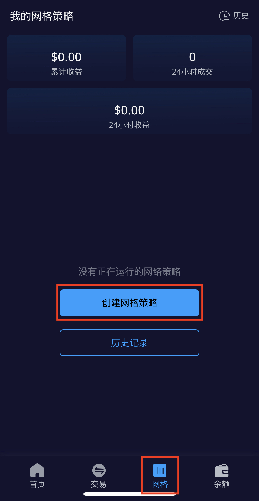
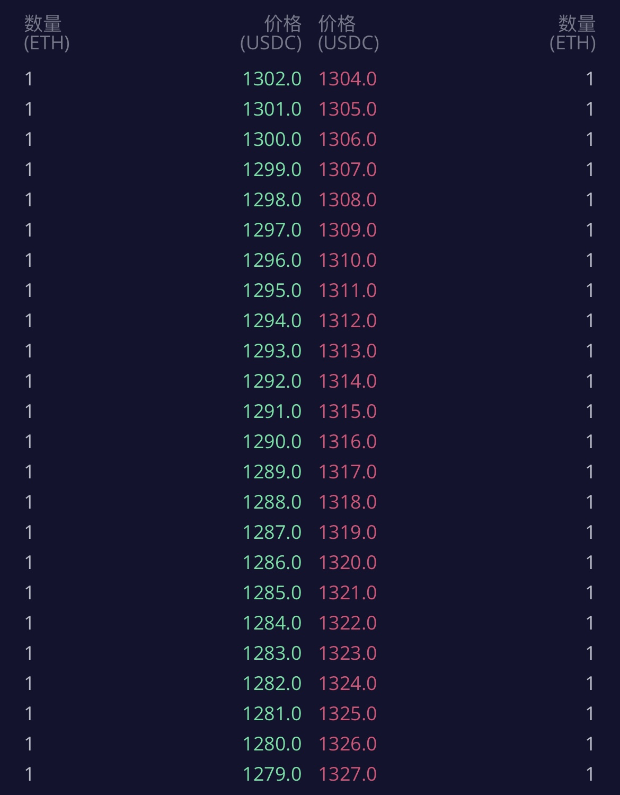

# 网格策略创建指南（移动端）

网格策略是一种强大的工具，能在预设的价格区间内，利用市场波动，通过设置多个买卖订单来实现自动低买高卖，从而实现盈利。&#x20;

## 如何在DeGate上创建网格策略？

在以太坊钱包中打开[**DeGate DEX**](https://app.degate.com/)**，**点击页面底部选择**网格策略**，选择**创建网格策略**

<figure><figcaption></figcaption></figure>

#### 创建网格

你可以在页面顶部搜索并选择想交易的交易对，例如ETH/USDC

然后根据你的偏好自定义网格策略参数，包括价格区间、初始投入、网格数、每格数量和有效期。

<figure><figcaption></figcaption></figure>

当然，你也可以选择“一键创建”，通过系统提供的价格区间和参数直接创建一个网格策略。

### 实例说明

假设当前以太坊价格为1303 USDC 时为例，选择在ETH/USDC交易对创建网格

* 输入价格区间：1200 - 1400 USDC

<figure><figcaption></figcaption></figure>

* 输入初始投入（我想投入的总资金）：输入97 ETH，系统将自动计算出USDC的数量

<figure><figcaption></figcaption></figure>

* 设置网格密度：网格数设置为200，系统将自动计算出每格数量

<figure><figcaption></figcaption></figure>

创建网格策略创建成功之后，DeGate系统将在价格区间内设置多个买卖限价订单

<figure><figcaption></figcaption></figure>

网格机器人将会在设置的价格区间内不断地进行低买高卖自动产生收益。原理如下图：

<figure><figcaption></figcaption></figure>

当完成一次低买高卖后，您将获利1 USDC

**注意：**

以文中的ETH/USDC网格策略为例，请确保当前市场价处于您设置的价格区间内（1200-1400），否则网格策略将不再产生收益。
