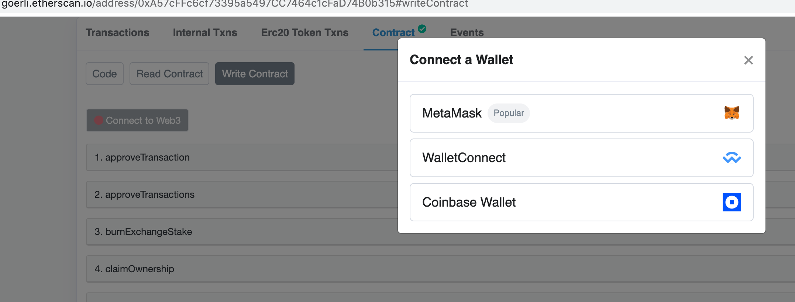

# How to withdraw assets in Exodus Mode

### What is Exodus Mode

Exodus Mode allows users to retrieve assets in their DeGate account without the involvement of any third party. When the Exodus Mode is activated, DeGate smart contract rejects receiving new zkBlock data (all off-chain activities will cease). DeGate protocol will only support the withdrawal of user assets back to their wallet address.&#x20;

Users need to get the Merkel Tree data of the account and assets, and call the DeGate smart contract interface with this data to retrieve the assets.

### Which contract interface to call

Firstly, any user can initiate a `forceWithdraw` transaction.

```
function forceWithdraw(
    address from,
    address token,
    uint32  accountID
)
```

If the transaction is not processed within 15 days, any user can activate Exodus Mode by calling `notifyForcedRequestTooOld`.

```
function notifyForcedRequestTooOld(
    uint32  accountID,
    address token
)
```

After Exodus Mode enable, users can call `withdrawFromMerkleTree` to withdraw their assets.

```
function withdrawFromMerkleTree(
    MerkleProof calldata merkleProof
)
```

Parameter definition

```
struct AccountLeaf
{
    uint32   accountID;
    address  owner;
    uint     pubKeyX;
    uint     pubKeyY;
    uint32   nonce;
}

struct BalanceLeaf
{
    uint32  tokenID;
    uint248 balance;
}

struct MerkleProof
{
    AccountLeaf accountLeaf;
    BalanceLeaf balanceLeaf;
    uint[48]                 accountMerkleProof;
    uint[48]                 balanceMerkleProof;
}
```

* accountLeaf, is the leaf node of the account
* balanceLeaf, is the leaf node of the token
* accountMerkleProof，is proof from the account leaf node to the root node of the asset tree. This is a quadtree with 16 levels. The account root is the root of the asset tree.
* balanceMerkleProof，is proof from the balance leaf node to the root node of the balance subtree. This is a quadtree with 16 levels. The balance root, which is part of the account leaf node, is used to participate in the calculation of the account node.

### How to get withdraw parameters

To make it easier for users to get the withdraw parameters, DeGate has developed an open-source tool. https://github.com/degatedev/DeGate-state-recover&#x20;

The tool synchronizes DeGate's L2 blocks from the chain, builds the latest asset tree locally, and finally extracts the parameters required by the user from the asset tree. The user needs to provide the account address and token address to execute the tool.

An example of the MerkleProof parameter：

```
[["17","0xE4fFF45bECF3EE5a65b0563404760017A0594352","8161251153248261275043969491129167598885227666378836210001209618404951884654","16758824516865810185821970741484590471435780567774575479532440497939966949519",1],["0","1190000000000000000"],["6606543114758994169809326545787088034672865411219056671939506357179194352239","625975369502742187269080093075406718801129898985287910113591383414894258630","11988097083988802363738450304679650297759690535257641492596726245016084965490","8684686624291200197817348965486211201989317161184421182653699873100319645909","8684686624291200197817348965486211201989317161184421182653699873100319645909","8684686624291200197817348965486211201989317161184421182653699873100319645909","9447249308951115614577393662933029122980930371500385998227764743908690109775","10825564878823541089934942805714292179083968573558088991676978307100253458682","10825564878823541089934942805714292179083968573558088991676978307100253458682","14859529381350112530778465487802109081767034129177331692353359342260393964835","14859529381350112530778465487802109081767034129177331692353359342260393964835","14859529381350112530778465487802109081767034129177331692353359342260393964835","1026533102660482948900852029327909642750935536631238755399814664977074434045","1026533102660482948900852029327909642750935536631238755399814664977074434045","1026533102660482948900852029327909642750935536631238755399814664977074434045","13323512689271197789701531850603295895817458193009513776124749604011913232211","13323512689271197789701531850603295895817458193009513776124749604011913232211","13323512689271197789701531850603295895817458193009513776124749604011913232211","12118642645408107593429278848228191414695161263075505828479258863580181691836","12118642645408107593429278848228191414695161263075505828479258863580181691836","12118642645408107593429278848228191414695161263075505828479258863580181691836","5203335005171162048985782130878200333224755074743196108484975037601854702492","5203335005171162048985782130878200333224755074743196108484975037601854702492","5203335005171162048985782130878200333224755074743196108484975037601854702492","3054162835117725807565327457127960975562469993566872122458942246581257586284","3054162835117725807565327457127960975562469993566872122458942246581257586284","3054162835117725807565327457127960975562469993566872122458942246581257586284","16829914903467335181495626088593998365068313259880500605410038708165044908818","16829914903467335181495626088593998365068313259880500605410038708165044908818","16829914903467335181495626088593998365068313259880500605410038708165044908818","3753653301858465039416039764332616608306132674462587525454509852359252464060","3753653301858465039416039764332616608306132674462587525454509852359252464060","3753653301858465039416039764332616608306132674462587525454509852359252464060","5110800259272497938130913661527918956590182090489349818781350014896761228737","5110800259272497938130913661527918956590182090489349818781350014896761228737","5110800259272497938130913661527918956590182090489349818781350014896761228737","14043546104713668109972746140214524068225910087314710106225379739043686438694","14043546104713668109972746140214524068225910087314710106225379739043686438694","14043546104713668109972746140214524068225910087314710106225379739043686438694","14957089653308603729607106600169756218508572609880465615915065621043162174774","14957089653308603729607106600169756218508572609880465615915065621043162174774","14957089653308603729607106600169756218508572609880465615915065621043162174774","11346867960271796555032620905716878909393349582686125719992422767386881669864","11346867960271796555032620905716878909393349582686125719992422767386881669864","11346867960271796555032620905716878909393349582686125719992422767386881669864","3189120152858579627586741254984548777907595153097813506247497517015067769656","3189120152858579627586741254984548777907595153097813506247497517015067769656","3189120152858579627586741254984548777907595153097813506247497517015067769656"],["18298609842015643040044099129089617646726077709878673957695062439183530196057","13743191796602693712119085269701632732485515451147218467296470668268114590480","11544680680781283868765249912342465744354511057753619816993706428838407483850","2371789476252246873145569183657984076150578936906379480269269056232125907764","2371789476252246873145569183657984076150578936906379480269269056232125907764","2371789476252246873145569183657984076150578936906379480269269056232125907764","8800186346908183461856028750254793130520064617249067863214641604786981171326","8800186346908183461856028750254793130520064617249067863214641604786981171326","8800186346908183461856028750254793130520064617249067863214641604786981171326","450569423324398381878223050304711553427091274530305503127765682565001437816","450569423324398381878223050304711553427091274530305503127765682565001437816","450569423324398381878223050304711553427091274530305503127765682565001437816","19316706057866088599694844743452177063937400906307042325376077309033687477087","19316706057866088599694844743452177063937400906307042325376077309033687477087","19316706057866088599694844743452177063937400906307042325376077309033687477087","3555867249999216554532402585819161678647739033440489641964733950427369655472","3555867249999216554532402585819161678647739033440489641964733950427369655472","3555867249999216554532402585819161678647739033440489641964733950427369655472","795979465643493012323073720522215153926162619126462630791100824127044582363","795979465643493012323073720522215153926162619126462630791100824127044582363","795979465643493012323073720522215153926162619126462630791100824127044582363","6592749167578234498153410564243369229486412054742481069049239297514590357090","6592749167578234498153410564243369229486412054742481069049239297514590357090","6592749167578234498153410564243369229486412054742481069049239297514590357090","13496785274171722928360638019535868563211704488062706656978266347098011881961","13496785274171722928360638019535868563211704488062706656978266347098011881961","13496785274171722928360638019535868563211704488062706656978266347098011881961","18141353858594260177380730431902803944325480636007600232984779833979711584621","18141353858594260177380730431902803944325480636007600232984779833979711584621","18141353858594260177380730431902803944325480636007600232984779833979711584621","20772550800217140083457856131137709414136053239493133436948426181228534942026","20772550800217140083457856131137709414136053239493133436948426181228534942026","20772550800217140083457856131137709414136053239493133436948426181228534942026","16068673802796300181665324898495388061238558011278046077031264292881458936678","16068673802796300181665324898495388061238558011278046077031264292881458936678","16068673802796300181665324898495388061238558011278046077031264292881458936678","5322606459646595993930753569217857735136759817162537787382195950121992047664","5322606459646595993930753569217857735136759817162537787382195950121992047664","5322606459646595993930753569217857735136759817162537787382195950121992047664","7571892690773059528618652901209788115755410973242595572211552684206269044675","7571892690773059528618652901209788115755410973242595572211552684206269044675","7571892690773059528618652901209788115755410973242595572211552684206269044675","5510089495238562706172892659449796873422711275069956468035719580686713779603","5510089495238562706172892659449796873422711275069956468035719580686713779603","5510089495238562706172892659449796873422711275069956468035719580686713779603","8589789729005292678407393934765522959861157726948742829224066115700840150996","8589789729005292678407393934765522959861157726948742829224066115700840150996","8589789729005292678407393934765522959861157726948742829224066115700840150996"]]
```

### User tutorial (use testnet contract as an example)

Exchange contract [https://goerli.etherscan.io/address/0xbcd394f0579db46f2b94d0490cee09bd34288c08#writeContract](https://goerli.etherscan.io/address/0xbcd394f0579db46f2b94d0490cee09bd34288c08#writeContract)

1.  Use Metamask to login on etherscan's Exchange contracts page  &#x20;

    <figure><figcaption></figcaption></figure>
2. Run `degate-state-recover` tool to get the MerkleProof parameter
3.  Select `withdrawFromMerkleTree` and enter the parameter&#x20;

    <figure><figcaption></figcaption></figure>
4. Send the transaction and confirm that it is successful [https://goerli.etherscan.io/tx/0x2dd077f5febd055bc44a4c184a3dc4a1e96536ef5bf9a661579cd17fff531321](https://goerli.etherscan.io/tx/0x2dd077f5febd055bc44a4c184a3dc4a1e96536ef5bf9a661579cd17fff531321)

<figure><figcaption></figcaption></figure>

#### Special instructions for Rinkeby testnet

Because Rinkeby testnet will be shutting down soon, etherscan has set Rinkeby to read-only mode, so users cannot withdraw through the above method.

1. Use contract ABI to interact with the exchange contract.

exchange contract address https://rinkeby.etherscan.io/address/0xdac304791b7f53593c701980aa52087ed7ec6649 exchange contract ABI

```
[
    {
        "inputs": [],
        "name": "getNumAvailableForcedSlots",
        "outputs": [
            {
                "internalType": "uint256",
                "name": "",
                "type": "uint256"
            }
        ],
        "stateMutability": "view",
        "type": "function",
        "constant": true
    },
    {
        "inputs": [
            {
                "components": [
                    {
                        "components": [
                            {
                                "internalType": "uint32",
                                "name": "accountID",
                                "type": "uint32"
                            },
                            {
                                "internalType": "address",
                                "name": "owner",
                                "type": "address"
                            },
                            {
                                "internalType": "uint256",
                                "name": "pubKeyX",
                                "type": "uint256"
                            },
                            {
                                "internalType": "uint256",
                                "name": "pubKeyY",
                                "type": "uint256"
                            },
                            {
                                "internalType": "uint32",
                                "name": "nonce",
                                "type": "uint32"
                            }
                        ],
                        "internalType": "struct ExchangeData.AccountLeaf",
                        "name": "accountLeaf",
                        "type": "tuple"
                    },
                    {
                        "components": [
                            {
                                "internalType": "uint32",
                                "name": "tokenID",
                                "type": "uint32"
                            },
                            {
                                "internalType": "uint248",
                                "name": "balance",
                                "type": "uint248"
                            }
                        ],
                        "internalType": "struct ExchangeData.BalanceLeaf",
                        "name": "balanceLeaf",
                        "type": "tuple"
                    },
                    {
                        "internalType": "uint256[48]",
                        "name": "accountMerkleProof",
                        "type": "uint256[48]"
                    },
                    {
                        "internalType": "uint256[48]",
                        "name": "balanceMerkleProof",
                        "type": "uint256[48]"
                    }
                ],
                "internalType": "struct ExchangeData.MerkleProof",
                "name": "merkleProof",
                "type": "tuple"
            }
        ],
        "name": "withdrawFromMerkleTree",
        "outputs": [],
        "stateMutability": "nonpayable",
        "type": "function"
    },
    {
        "inputs": [
            {
                "internalType": "uint32",
                "name": "accountID",
                "type": "uint32"
            },
            {
                "internalType": "address",
                "name": "token",
                "type": "address"
            }
        ],
        "name": "notifyForcedRequestTooOld",
        "outputs": [],
        "stateMutability": "nonpayable",
        "type": "function"
    }
]
```

2\. Use Rinkeby version of the degate-state-recover tool&#x20;

DeGate fixed some issues at Rinkeby, so users need to use Rinkeby's version of the recovery tool. Refer to [https://github.com/degatedev/degate-state-recover/tree/rinkeby](https://github.com/degatedev/degate-state-recover/tree/rinkeby) for more details.
