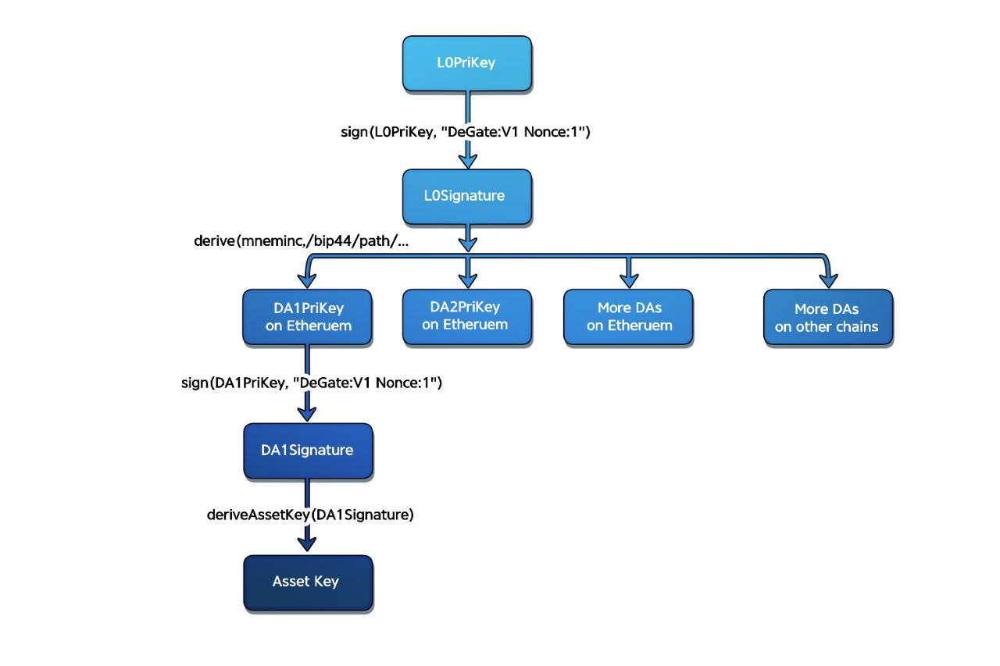

# Wallet Address

## **Wallet Addresses Across Chains**

Your wallet addresses are derived from a user's wallet key in a deterministic fashion (refer to image below).

<figure><figcaption></figcaption></figure>

### 1. User’s Wallet Key = L0PriKey

* Each user starts with an ECDSA private key. DeGate is not able to access the raw L0PriKey.

### 2. User Signs Deterministic Content → L0Signature

* DeGate requests a signature on a fixed message, such as “DeGate: V1 Nonce:1” by using L0PriKey. This ensures uniqueness per user and per key reset.
* The wallet responds with an ECDSA signature, which DeGate labels as L0Signature.

### 3. Generate Mnemonic (BIP39) from Hashed L0Signature

* DeGate’s front-end (or core code) hashes the L0Signature to create a seed.
* This seed is converted into a mnemonic phrase according to BIP39, a widely used standard in the crypto space (often recognized by 12–24 human-readable words).

### 4. Derive DAPrivKeys (BIP44) for Each Chain

* BIP44 is a framework for hierarchical deterministic wallets, allowing different derivation paths for different blockchains.
* Using the mnemonic, the user’s browser front-end derives wallet address private keys (DAPrivKeys). Each chain (e.g., Solana, Base) may have its own path or curve requirements, but the concept remains the same: the user now has a private key for each extended chain that is cryptographically tied back to user's original wallet.
* DeGate provides easy UI hooks so users do not have to manage multiple mnemonics or do the derivations manually

Each wallet address belongs exclusively to the user. If the user requests to swap USDC for SOL, the wallet address on Solana receives the tokens. Since only the user’s private key can authorize transactions from that address, DeGate (or any other external party) remains incapable of unilaterally moving the user’s funds.

\
